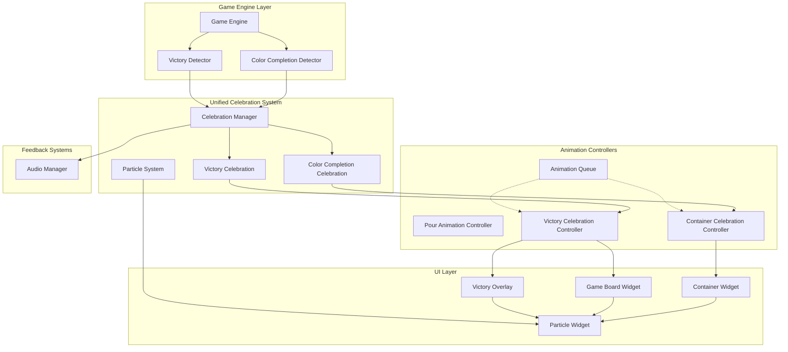

# Design Document

## Overview

The Color Completion Celebration feature adds localized mini celebration animations when a player successfully completes a color by filling a container with a single color. This feature integrates seamlessly with the existing Flutter-based Water Sort Puzzle architecture, leveraging the current animation system while adding new celebration-specific components.

The design focuses on creating visually appealing, performant, and non-disruptive celebrations that enhance the user experience without interfering with gameplay flow. The celebrations will include particle effects, container highlighting, audio feedback, and haptic feedback, all coordinated through a dedicated celebration animation system.

## Architecture

### High-Level Architecture



### Integration with Existing System

The celebration system integrates with the existing architecture by:

1. **Game Engine Integration**: Extending the game engine to detect color completion events
2. **Animation System Integration**: Adding celebration animations to the existing AnimationQueue
3. **Container Widget Enhancement**: Extending ContainerWidget to render celebration effects
4. **Audio System Extension**: Adding new celebration sounds to the AudioManager

## Components and Interfaces

### Color Completion Detection

**ColorCompletionDetector**

```dart
class ColorCompletionDetector {
  /// Detect which containers were completed in a move
  static List<ColorCompletionEvent> detectCompletions(
    GameState previousState,
    GameState newState,
    Move move,
  );
  
  /// Check if a single container is completed
  static bool isContainerCompleted(Container container);
  
  /// Check if completion was caused by the current move
  static bool wasCompletedByMove(
    Container previousContainer,
    Container newContainer,
    Move move,
  );
}

class ColorCompletionEvent {
  final int containerId;
  final LiquidColor completedColor;
  final DateTime timestamp;
  final bool wasTriggeredByMove;
  
  const ColorCompletionEvent({
    required this.containerId,
    required this.completedColor,
    required this.timestamp,
    required this.wasTriggeredByMove,
  });
}
```

### Unified Celebration Animation System

**CelebrationManager**

```dart
class CelebrationManager extends ChangeNotifier {
  final AudioManager _audioManager;
  final AnimationQueue _animationQueue;
  final Map<int, CelebrationController> _activeContainerCelebrations = {};
  VictoryCelebrationController? _activeVictoryCelebration;
  
  CelebrationManager({
    required AudioManager audioManager,
    required AnimationQueue animationQueue,
  });
  
  /// Trigger celebration for completed containers
  void triggerColorCompletions(List<ColorCompletionEvent> completions);
  
  /// Trigger victory celebration for the entire game
  void triggerVictoryCelebration(GameState gameState);
  
  /// Start celebration for a specific container
  void startContainerCelebration(ColorCompletionEvent completion);
  
  /// Start victory celebration
  void startVictoryCelebration(GameState gameState);
  
  /// Check if a container is currently celebrating
  bool isContainerCelebrating(int containerId);
  
  /// Check if victory celebration is active
  bool isVictoryCelebrating();
  
  /// Get celebration controller for a container
  CelebrationController? getContainerCelebrationController(int containerId);
  
  /// Get victory celebration controller
  VictoryCelebrationController? getVictoryCelebrationController();
  
  /// Complete celebration for a container
  void completeContainerCelebration(int containerId);
  
  /// Complete victory celebration
  void completeVictoryCelebration();
  
  /// Skip all active celebrations
  void skipAllCelebrations();
}
```

**CelebrationAnimation**

```dart
abstract class CelebrationAnimation {
  final Duration duration;
  final CelebrationStyle style;
  final bool includeParticles;
  final bool includeGlow;
  
  const CelebrationAnimation({
    this.duration = const Duration(milliseconds: 2000),
    this.style = CelebrationStyle.sparkles,
    this.includeParticles = true,
    this.includeGlow = true,
  });
}

class ColorCompletionCelebration extends CelebrationAnimation {
  final int containerId;
  final LiquidColor celebratedColor;
  final bool includeColorPulse;
  
  const ColorCompletionCelebration({
    required this.containerId,
    required this.celebratedColor,
    super.duration = const Duration(milliseconds: 2000),
    super.style = CelebrationStyle.sparkles,
    super.includeParticles = true,
    super.includeGlow = true,
    this.includeColorPulse = true,
  });
}

class VictoryCelebration extends CelebrationAnimation {
  final List<Container> completedContainers;
  final int levelId;
  final int moveCount;
  final bool includeConfetti;
  final bool includeFireworks;
  
  const VictoryCelebration({
    required this.completedContainers,
    required this.levelId,
    required this.moveCount,
    super.duration = const Duration(milliseconds: 3000),
    super.style = CelebrationStyle.fireworks,
    super.includeParticles = true,
    super.includeGlow = true,
    this.includeConfetti = true,
    this.includeFireworks = true,
  });
}

enum CelebrationStyle {
  sparkles,
  burst,
  glow,
  pulse,
  fireworks,
  confetti,
}
```

**CelebrationController (for individual containers)**

```dart
class CelebrationController extends ChangeNotifier {
  late AnimationController _animationController;
  late Animation<double> _progressAnimation;
  late Animation<double> _glowAnimation;
  late Animation<double> _pulseAnimation;
  late Animation<double> _particleAnimation;
  
  final ColorCompletionCelebration celebration;
  final ParticleSystem particleSystem;
  
  CelebrationController({
    required this.celebration,
    required TickerProvider tickerProvider,
  }) : particleSystem = ParticleSystem(
         color: celebration.celebratedColor,
         containerId: celebration.containerId,
       );
  
  /// Initialize the animation controller
  void initialize();
  
  /// Start the celebration animation
  void start();
  
  /// Skip the celebration animation
  void skip();
  
  /// Get current celebration progress (0.0 to 1.0)
  double get progress;
  
  /// Get current glow intensity (0.0 to 1.0)
  double get glowIntensity;
  
  /// Get current pulse scale (0.8 to 1.2)
  double get pulseScale;
  
  /// Get current particle data
  List<Particle> get particles;
  
  /// Whether the celebration is currently active
  bool get isActive;
}
```

**VictoryCelebrationController (for game-wide victory)**

```dart
class VictoryCelebrationController extends ChangeNotifier {
  late AnimationController _animationController;
  late Animation<double> _progressAnimation;
  late Animation<double> _confettiAnimation;
  late Animation<double> _fireworksAnimation;
  late Animation<double> _scaleAnimation;
  
  final VictoryCelebration celebration;
  final List<ParticleSystem> containerParticleSystems;
  final ParticleSystem confettiSystem;
  final ParticleSystem fireworksSystem;
  
  VictoryCelebrationController({
    required this.celebration,
    required TickerProvider tickerProvider,
  }) : containerParticleSystems = celebration.completedContainers.map((container) =>
         ParticleSystem(
           color: container.topColor!,
           containerId: container.id,
         )).toList(),
       confettiSystem = ParticleSystem.confetti(),
       fireworksSystem = ParticleSystem.fireworks();
  
  /// Initialize the animation controller
  void initialize();
  
  /// Start the victory celebration animation
  void start();
  
  /// Skip the victory celebration animation
  void skip();
  
  /// Get current celebration progress (0.0 to 1.0)
  double get progress;
  
  /// Get current confetti intensity (0.0 to 1.0)
  double get confettiIntensity;
  
  /// Get current fireworks intensity (0.0 to 1.0)
  double get fireworksIntensity;
  
  /// Get current scale multiplier for victory effects
  double get scaleMultiplier;
  
  /// Get all particle systems for rendering
  List<ParticleSystem> get allParticleSystems;
  
  /// Whether the victory celebration is currently active
  bool get isActive;
}
```

### Particle System

**ParticleSystem**

```dart
class ParticleSystem {
  final LiquidColor color;
  final int containerId;
  final List<Particle> _particles = [];
  final Random _random = Random();
  
  ParticleSystem({
    required this.color,
    required this.containerId,
  });
  
  /// Generate initial particles for celebration
  void generateParticles({
    required Offset containerCenter,
    required Size containerSize,
    int particleCount = 20,
  });
  
  /// Update particle positions and properties
  void updateParticles(double deltaTime);
  
  /// Get current active particles
  List<Particle> get particles => List.unmodifiable(_particles);
  
  /// Clear all particles
  void clearParticles();
  
  /// Whether particles are still active
  bool get hasActiveParticles;
}

class Particle {
  Offset position;
  Offset velocity;
  double size;
  double opacity;
  Color color;
  double life;
  double maxLife;
  ParticleType type;
  
  Particle({
    required this.position,
    required this.velocity,
    required this.size,
    required this.opacity,
    required this.color,
    required this.life,
    required this.maxLife,
    required this.type,
  });
  
  /// Update particle state
  void update(double deltaTime);
  
  /// Whether the particle is still alive
  bool get isAlive => life > 0;
}

enum ParticleType {
  sparkle,
  star,
  circle,
  diamond,
  heart,
}
```

### Enhanced Container Widget

**Enhanced ContainerWidget Integration**

```dart
// Extension to existing ContainerWidget
class ContainerWidget extends StatefulWidget {
  // ... existing properties ...
  
  /// Celebration controller for this container
  final CelebrationController? celebrationController;
  
  const ContainerWidget({
    // ... existing parameters ...
    this.celebrationController,
  });
}

class _ContainerWidgetState extends State<ContainerWidget>
    with TickerProviderStateMixin {
  // ... existing code ...
  
  @override
  Widget build(BuildContext context) {
    final containerSize = _getResponsiveSize(context);
    
    return GestureDetector(
      onTap: _handleTap,
      child: AnimatedBuilder(
        animation: Listenable.merge([
          _selectionAnimation, 
          _tapAnimation,
          if (widget.pourAnimationController != null) widget.pourAnimationController!,
          if (widget.celebrationController != null) widget.celebrationController!,
        ]),
        builder: (context, child) {
          return Transform.scale(
            scale: _tapAnimation.value * _getCelebrationScale(),
            child: Stack(
              clipBehavior: Clip.none,
              children: [
                // Existing container
                Container(
                  width: containerSize.width,
                  height: containerSize.height,
                  margin: const EdgeInsets.all(4.0),
                  child: CustomPaint(
                    painter: ContainerPainter(
                      container: widget.container,
                      isSelected: widget.isSelected,
                      selectionProgress: _selectionAnimation.value,
                      pourProgress: widget.pourAnimationController?.progress,
                      pourAnimation: widget.pourAnimationController?.currentAnimation,
                      celebrationController: widget.celebrationController,
                    ),
                    size: containerSize,
                  ),
                ),
                
                // Celebration particles overlay
                if (widget.celebrationController?.isActive == true)
                  Positioned.fill(
                    child: ParticleWidget(
                      particles: widget.celebrationController!.particles,
                      containerSize: containerSize,
                    ),
                  ),
              ],
            ),
          );
        },
      ),
    );
  }
  
  double _getCelebrationScale() {
    if (widget.celebrationController?.isActive == true) {
      return widget.celebrationController!.pulseScale;
    }
    return 1.0;
  }
}
```

**Enhanced ContainerPainter**

```dart
class ContainerPainter extends CustomPainter {
  // ... existing properties ...
  final CelebrationController? celebrationController;
  
  ContainerPainter({
    // ... existing parameters ...
    this.celebrationController,
  });
  
  @override
  void paint(Canvas canvas, Size size) {
    final paint = Paint();
    
    // Draw existing container elements
    _drawContainerOutline(canvas, size, paint);
    _drawLiquidLayers(canvas, size, paint);
    
    // Draw celebration effects
    if (celebrationController?.isActive == true) {
      _drawCelebrationEffects(canvas, size, paint);
    }
    
    // Draw existing selection and pour effects
    if (isSelected && selectionProgress > 0) {
      _drawSelectionHighlight(canvas, size, paint);
    }
    
    if (pourProgress != null && pourAnimation != null) {
      _drawPourAnimation(canvas, size, paint);
    }
  }
  
  void _drawCelebrationEffects(Canvas canvas, Size size, Paint paint) {
    final controller = celebrationController!;
    
    // Draw glow effect
    if (controller.celebration.includeGlow) {
      _drawCelebrationGlow(canvas, size, paint, controller);
    }
    
    // Draw color pulse effect
    if (controller.celebration.includeColorPulse) {
      _drawColorPulse(canvas, size, paint, controller);
    }
    
    // Draw container highlight
    _drawCelebrationHighlight(canvas, size, paint, controller);
  }
  
  void _drawCelebrationGlow(Canvas canvas, Size size, Paint paint, CelebrationController controller) {
    final glowIntensity = controller.glowIntensity;
    if (glowIntensity <= 0) return;
    
    final center = Offset(size.width / 2, size.height / 2);
    final baseRadius = size.width / 2;
    
    // Create radial gradient for glow effect
    final gradient = RadialGradient(
      colors: [
        controller.celebration.celebratedColor.color.withValues(alpha: glowIntensity * 0.6),
        controller.celebration.celebratedColor.color.withValues(alpha: glowIntensity * 0.3),
        controller.celebration.celebratedColor.color.withValues(alpha: 0.0),
      ],
      stops: const [0.0, 0.7, 1.0],
    );
    
    paint.shader = gradient.createShader(Rect.fromCircle(
      center: center,
      radius: baseRadius * (1.0 + glowIntensity * 0.5),
    ));
    
    canvas.drawCircle(center, baseRadius * (1.0 + glowIntensity * 0.5), paint);
    paint.shader = null;
  }
  
  void _drawColorPulse(Canvas canvas, Size size, Paint paint, CelebrationController controller) {
    if (!container.isCompleted) return;
    
    final pulseIntensity = controller.glowIntensity;
    if (pulseIntensity <= 0) return;
    
    // Enhance the liquid color with pulse effect
    const double wallThickness = 3.0;
    const double bottomThickness = 4.0;
    
    final liquidRect = Rect.fromLTWH(
      wallThickness,
      wallThickness,
      size.width - (wallThickness * 2),
      size.height - wallThickness - bottomThickness,
    );
    
    // Draw pulsing overlay on the liquid
    paint.color = controller.celebration.celebratedColor.color.withValues(alpha: pulseIntensity * 0.3);
    paint.style = PaintingStyle.fill;
    
    final path = Path();
    path.addRRect(RRect.fromRectAndCorners(
      liquidRect,
      bottomLeft: const Radius.circular(8),
      bottomRight: const Radius.circular(8),
    ));
    
    canvas.drawPath(path, paint);
  }
  
  void _drawCelebrationHighlight(Canvas canvas, Size size, Paint paint, CelebrationController controller) {
    final progress = controller.progress;
    if (progress <= 0) return;
    
    // Draw animated highlight ring
    paint.style = PaintingStyle.stroke;
    paint.strokeWidth = 4.0;
    paint.color = controller.celebration.celebratedColor.color.withValues(alpha: progress * 0.8);
    
    final center = Offset(size.width / 2, size.height / 2);
    final radius = (size.width / 2) + (15 * progress);
    
    canvas.drawCircle(center, radius, paint);
    
    // Draw inner highlight
    paint.strokeWidth = 2.0;
    paint.color = Colors.white.withValues(alpha: progress * 0.6);
    canvas.drawCircle(center, radius - 2, paint);
  }
}
```

**ParticleWidget**

```dart
class ParticleWidget extends StatelessWidget {
  final List<Particle> particles;
  final Size containerSize;
  
  const ParticleWidget({
    super.key,
    required this.particles,
    required this.containerSize,
  });
  
  @override
  Widget build(BuildContext context) {
    return CustomPaint(
      painter: ParticlePainter(particles: particles),
      size: containerSize,
    );
  }
}

class ParticlePainter extends CustomPainter {
  final List<Particle> particles;
  
  ParticlePainter({required this.particles});
  
  @override
  void paint(Canvas canvas, Size size) {
    final paint = Paint();
    
    for (final particle in particles) {
      if (!particle.isAlive) continue;
      
      paint.color = particle.color.withValues(alpha: particle.opacity);
      paint.style = PaintingStyle.fill;
      
      switch (particle.type) {
        case ParticleType.sparkle:
          _drawSparkle(canvas, particle, paint);
          break;
        case ParticleType.star:
          _drawStar(canvas, particle, paint);
          break;
        case ParticleType.circle:
          _drawCircle(canvas, particle, paint);
          break;
        case ParticleType.diamond:
          _drawDiamond(canvas, particle, paint);
          break;
        case ParticleType.heart:
          _drawHeart(canvas, particle, paint);
          break;
      }
    }
  }
  
  void _drawSparkle(Canvas canvas, Particle particle, Paint paint) {
    final center = particle.position;
    final size = particle.size;
    
    // Draw cross-shaped sparkle
    paint.strokeWidth = 2.0;
    paint.style = PaintingStyle.stroke;
    
    // Horizontal line
    canvas.drawLine(
      Offset(center.dx - size, center.dy),
      Offset(center.dx + size, center.dy),
      paint,
    );
    
    // Vertical line
    canvas.drawLine(
      Offset(center.dx, center.dy - size),
      Offset(center.dx, center.dy + size),
      paint,
    );
    
    // Diagonal lines for extra sparkle
    canvas.drawLine(
      Offset(center.dx - size * 0.7, center.dy - size * 0.7),
      Offset(center.dx + size * 0.7, center.dy + size * 0.7),
      paint,
    );
    
    canvas.drawLine(
      Offset(center.dx - size * 0.7, center.dy + size * 0.7),
      Offset(center.dx + size * 0.7, center.dy - size * 0.7),
      paint,
    );
  }
  
  void _drawStar(Canvas canvas, Particle particle, Paint paint) {
    final center = particle.position;
    final size = particle.size;
    
    paint.style = PaintingStyle.fill;
    
    final path = Path();
    const int points = 5;
    const double angle = 2 * 3.14159 / points;
    
    for (int i = 0; i < points * 2; i++) {
      final radius = (i % 2 == 0) ? size : size * 0.5;
      final x = center.dx + radius * (angle * i / 2).cos();
      final y = center.dy + radius * (angle * i / 2).sin();
      
      if (i == 0) {
        path.moveTo(x, y);
      } else {
        path.lineTo(x, y);
      }
    }
    
    path.close();
    canvas.drawPath(path, paint);
  }
  
  void _drawCircle(Canvas canvas, Particle particle, Paint paint) {
    paint.style = PaintingStyle.fill;
    canvas.drawCircle(particle.position, particle.size, paint);
  }
  
  void _drawDiamond(Canvas canvas, Particle particle, Paint paint) {
    final center = particle.position;
    final size = particle.size;
    
    paint.style = PaintingStyle.fill;
    
    final path = Path();
    path.moveTo(center.dx, center.dy - size);
    path.lineTo(center.dx + size, center.dy);
    path.lineTo(center.dx, center.dy + size);
    path.lineTo(center.dx - size, center.dy);
    path.close();
    
    canvas.drawPath(path, paint);
  }
  
  void _drawHeart(Canvas canvas, Particle particle, Paint paint) {
    final center = particle.position;
    final size = particle.size;
    
    paint.style = PaintingStyle.fill;
    
    final path = Path();
    
    // Heart shape using curves
    path.moveTo(center.dx, center.dy + size * 0.3);
    
    // Left curve
    path.cubicTo(
      center.dx - size * 0.5, center.dy - size * 0.3,
      center.dx - size, center.dy - size * 0.1,
      center.dx - size * 0.5, center.dy + size * 0.1,
    );
    
    // Bottom point
    path.lineTo(center.dx, center.dy + size);
    
    // Right curve
    path.lineTo(center.dx + size * 0.5, center.dy + size * 0.1);
    path.cubicTo(
      center.dx + size, center.dy - size * 0.1,
      center.dx + size * 0.5, center.dy - size * 0.3,
      center.dx, center.dy + size * 0.3,
    );
    
    canvas.drawPath(path, paint);
  }
  
  @override
  bool shouldRepaint(ParticlePainter oldDelegate) {
    return oldDelegate.particles != particles;
  }
}

// Extension methods for mathematical operations
extension DoubleExtension on double {
  double cos() => math.cos(this);
  double sin() => math.sin(this);
}
```

### Audio System Enhancement

**Enhanced AudioManager**

```dart
// Extension to existing AudioManager
extension CelebrationAudio on AudioManager {
  /// Play color completion celebration sound
  Future<void> playColorCompletionSound() async {
    if (soundEnabled) {
      await _playSound('audio/color_completion.mp3', 'color_completion');
    }
  }
  
  /// Play celebration haptic feedback
  Future<void> celebrationHaptic() async {
    if (hapticEnabled) {
      try {
        // Custom celebration haptic pattern
        await HapticFeedback.heavyImpact();
        await Future.delayed(const Duration(milliseconds: 100));
        await HapticFeedback.lightImpact();
        await Future.delayed(const Duration(milliseconds: 50));
        await HapticFeedback.lightImpact();
      } catch (e) {
        print('Error triggering celebration haptic: $e');
      }
    }
  }
}
```

## Data Models

### Celebration Data Structures

**CelebrationState**

```dart
@JsonSerializable()
class CelebrationState {
  final Map<int, bool> activeCelebrations;
  final DateTime? lastCelebrationTime;
  final int totalCelebrations;
  
  const CelebrationState({
    required this.activeCelebrations,
    this.lastCelebrationTime,
    required this.totalCelebrations,
  });
  
  factory CelebrationState.initial() {
    return const CelebrationState(
      activeCelebrations: {},
      totalCelebrations: 0,
    );
  }
  
  CelebrationState copyWith({
    Map<int, bool>? activeCelebrations,
    DateTime? lastCelebrationTime,
    int? totalCelebrations,
  }) {
    return CelebrationState(
      activeCelebrations: activeCelebrations ?? this.activeCelebrations,
      lastCelebrationTime: lastCelebrationTime ?? this.lastCelebrationTime,
      totalCelebrations: totalCelebrations ?? this.totalCelebrations,
    );
  }
  
  factory CelebrationState.fromJson(Map<String, dynamic> json) =>
      _$CelebrationStateFromJson(json);
  Map<String, dynamic> toJson() => _$CelebrationStateToJson(this);
}
```

**CelebrationSettings**

```dart
@JsonSerializable()
class CelebrationSettings {
  final bool celebrationsEnabled;
  final CelebrationStyle defaultStyle;
  final Duration celebrationDuration;
  final bool particlesEnabled;
  final bool glowEnabled;
  final bool pulseEnabled;
  final double celebrationVolume;
  
  const CelebrationSettings({
    this.celebrationsEnabled = true,
    this.defaultStyle = CelebrationStyle.sparkles,
    this.celebrationDuration = const Duration(milliseconds: 2000),
    this.particlesEnabled = true,
    this.glowEnabled = true,
    this.pulseEnabled = true,
    this.celebrationVolume = 1.0,
  });
  
  CelebrationSettings copyWith({
    bool? celebrationsEnabled,
    CelebrationStyle? defaultStyle,
    Duration? celebrationDuration,
    bool? particlesEnabled,
    bool? glowEnabled,
    bool? pulseEnabled,
    double? celebrationVolume,
  }) {
    return CelebrationSettings(
      celebrationsEnabled: celebrationsEnabled ?? this.celebrationsEnabled,
      defaultStyle: defaultStyle ?? this.defaultStyle,
      celebrationDuration: celebrationDuration ?? this.celebrationDuration,
      particlesEnabled: particlesEnabled ?? this.particlesEnabled,
      glowEnabled: glowEnabled ?? this.glowEnabled,
      pulseEnabled: pulseEnabled ?? this.pulseEnabled,
      celebrationVolume: celebrationVolume ?? this.celebrationVolume,
    );
  }
  
  factory CelebrationSettings.fromJson(Map<String, dynamic> json) =>
      _$CelebrationSettingsFromJson(json);
  Map<String, dynamic> toJson() => _$CelebrationSettingsToJson(this);
}
```

## Error Handling

### Celebration-Specific Error Handling

**CelebrationException**

```dart
abstract class CelebrationException implements Exception {
  final String message;
  final dynamic cause;
  
  const CelebrationException(this.message, [this.cause]);
}

class CelebrationAnimationException extends CelebrationException {
  const CelebrationAnimationException(String message, [dynamic cause]) 
      : super(message, cause);
}

class ParticleSystemException extends CelebrationException {
  const ParticleSystemException(String message, [dynamic cause]) 
      : super(message, cause);
}

class CelebrationAudioException extends CelebrationException {
  const CelebrationAudioException(String message, [dynamic cause]) 
      : super(message, cause);
}
```

**Error Recovery Strategies**

- **Animation Failures**: Gracefully skip celebration animations without affecting gameplay
- **Particle System Errors**: Fall back to simple glow effects if particle rendering fails
- **Audio Failures**: Continue with visual celebration if audio cannot be played
- **Performance Issues**: Automatically reduce particle count or disable effects on low-end devices

## Testing Strategy

### Unit Testing

**Celebration Logic Testing**

- Color completion detection accuracy
- Celebration timing and triggering
- Particle system behavior and lifecycle
- Animation state management
- Audio integration testing

**Test Coverage Requirements**

- 95%+ coverage for color completion detection
- 90%+ coverage for celebration animation logic
- 100% coverage for celebration triggering conditions
- Edge case testing for simultaneous celebrations

### Widget Testing

**Celebration UI Testing**

- Particle rendering accuracy
- Celebration animation visual correctness
- Container enhancement integration
- Performance under various celebration scenarios

### Integration Testing

**End-to-End Celebration Flow**

- Complete celebration workflow from detection to completion
- Multiple simultaneous celebrations
- Celebration interruption and cleanup
- Audio and haptic feedback integration

### Performance Testing

**Celebration Performance**

- Particle system performance with varying particle counts
- Memory usage during celebrations
- Frame rate maintenance during celebrations
- Battery impact assessment

## Implementation Details

### Animation Performance Optimization

**Efficient Particle Management**

- Object pooling for particle instances
- Culling of off-screen particles
- Adaptive particle count based on device performance
- Efficient particle update algorithms

**Memory Management**

- Proper disposal of animation controllers
- Particle cleanup after celebrations
- Texture atlas for particle sprites
- Minimal memory allocation during animations

### Platform-Specific Considerations

**iOS Optimizations**

- Metal rendering for particle effects
- Core Animation integration
- iOS-specific haptic feedback patterns

**Android Optimizations**

- Vulkan API support for advanced effects
- Android-specific vibration patterns
- Adaptive performance based on device capabilities

### Accessibility

**Celebration Accessibility**

- Reduced motion support for users with vestibular disorders
- High contrast mode support
- Screen reader announcements for color completions
- Customizable celebration intensity settings

This design provides a comprehensive foundation for implementing engaging, performant, and accessible color completion celebrations that enhance the Water Sort Puzzle experience without disrupting gameplay flow.