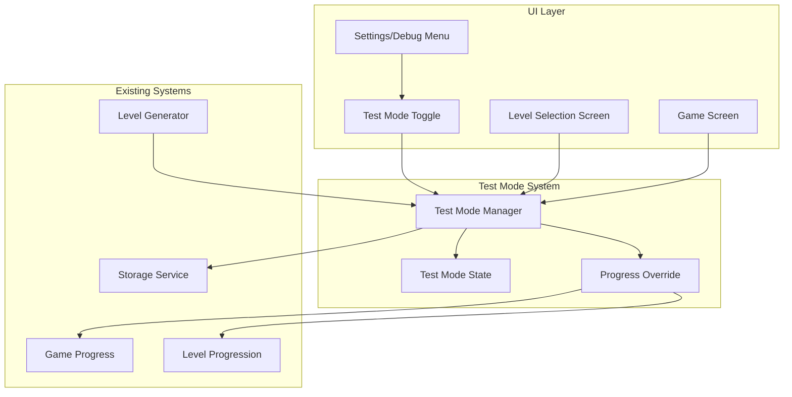

# Design Document

## Overview

The Test Mode feature will be implemented as a developer-focused toggle that overrides the normal level progression system. The design leverages the existing level management infrastructure while adding a test mode layer that bypasses unlock restrictions. The implementation will use a simple boolean flag stored in SharedPreferences to persist the test mode state, and will integrate with the existing GameProgress and LevelProgression systems without modifying core game mechanics.

The design ensures complete separation between test mode access and legitimate player progress, maintaining data integrity while providing developers with unrestricted access to all game content for testing purposes.

## Architecture

### High-Level Architecture



### Integration with Existing Systems

The test mode system will integrate with existing components without requiring modifications to core game logic:

- **Level Selection Screen**: Will query TestModeManager to determine level accessibility
- **Game Progress**: Will be wrapped by ProgressOverride to provide test mode behavior
- **Level Generator**: Will receive test mode context for unrestricted level generation
- **Storage Service**: Will persist test mode preference alongside existing game data

## Components and Interfaces

### Test Mode Manager

**TestModeManager**

```dart
class TestModeManager {
  static const String _testModeKey = 'test_mode_enabled';
  final SharedPreferences _prefs;
  final StreamController<bool> _testModeController = StreamController<bool>.broadcast();

  TestModeManager(this._prefs);

  /// Current test mode state
  bool get isTestModeEnabled => _prefs.getBool(_testModeKey) ?? false;

  /// Stream of test mode state changes
  Stream<bool> get testModeStream => _testModeController.stream;

  /// Enable or disable test mode
  Future<void> setTestMode(bool enabled) async {
    await _prefs.setBool(_testModeKey, enabled);
    _testModeController.add(enabled);
  }

  /// Check if a level should be accessible (considering test mode)
  bool isLevelAccessible(int levelId, Set<int> normallyUnlockedLevels) {
    if (isTestModeEnabled) {
      return true; // All levels accessible in test mode
    }
    return normallyUnlockedLevels.contains(levelId);
  }

  /// Get visual indicator data for test mode
  TestModeIndicator? getTestModeIndicator() {
    if (!isTestModeEnabled) return null;
    
    return TestModeIndicator(
      text: 'TEST MODE',
      color: Colors.orange,
      icon: Icons.bug_report,
    );
  }

  /// Generate level with test mode context
  Level generateLevelForTesting(int levelId, int difficulty) {
    // Bypass normal progression restrictions
    return LevelGenerator.generateLevel(
      levelId: levelId,
      difficulty: difficulty,
      ignoreProgressionLimits: isTestModeEnabled,
    );
  }

  void dispose() {
    _testModeController.close();
  }
}

class TestModeIndicator {
  final String text;
  final Color color;
  final IconData icon;

  TestModeIndicator({
    required this.text,
    required this.color,
    required this.icon,
  });
}
```

### Progress Override System

**ProgressOverride**

```dart
class ProgressOverride {
  final GameProgress _actualProgress;
  final TestModeManager _testModeManager;

  ProgressOverride(this._actualProgress, this._testModeManager);

  /// Get unlocked levels considering test mode
  Set<int> get unlockedLevels {
    if (_testModeManager.isTestModeEnabled) {
      // Return all possible level IDs (1 to max level)
      return Set<int>.from(List.generate(1000, (index) => index + 1));
    }
    return _actualProgress.unlockedLevels;
  }

  /// Get completed levels (always actual progress)
  Set<int> get completedLevels => _actualProgress.completedLevels;

  /// Check if level is accessible
  bool isLevelUnlocked(int levelId) {
    return _testModeManager.isLevelAccessible(levelId, _actualProgress.unlockedLevels);
  }

  /// Complete a level (only affects actual progress if legitimately unlocked)
  Future<void> completeLevel(int levelId) async {
    // Only mark as completed if it was legitimately unlocked
    if (_actualProgress.unlockedLevels.contains(levelId)) {
      await _actualProgress.completeLevel(levelId);
    }
    // In test mode, don't modify actual progress for illegitimate completions
  }

  /// Get the actual progress (for persistence)
  GameProgress get actualProgress => _actualProgress;
}
```

### UI Components

**Test Mode Toggle Widget**

```dart
class TestModeToggle extends StatefulWidget {
  final TestModeManager testModeManager;

  const TestModeToggle({
    Key? key,
    required this.testModeManager,
  }) : super(key: key);

  @override
  _TestModeToggleState createState() => _TestModeToggleState();
}

class _TestModeToggleState extends State<TestModeToggle> {
  late bool _isEnabled;

  @override
  void initState() {
    super.initState();
    _isEnabled = widget.testModeManager.isTestModeEnabled;
  }

  @override
  Widget build(BuildContext context) {
    return Card(
      color: _isEnabled ? Colors.orange.shade100 : null,
      child: ListTile(
        leading: Icon(
          Icons.bug_report,
          color: _isEnabled ? Colors.orange : Colors.grey,
        ),
        title: const Text('Test Mode'),
        subtitle: Text(
          _isEnabled 
            ? 'All levels unlocked for testing'
            : 'Normal progression rules apply',
        ),
        trailing: Switch(
          value: _isEnabled,
          onChanged: (value) async {
            await widget.testModeManager.setTestMode(value);
            setState(() {
              _isEnabled = value;
            });
          },
        ),
      ),
    );
  }
}
```

**Test Mode Indicator Widget**

```dart
class TestModeIndicatorWidget extends StatelessWidget {
  final TestModeIndicator indicator;

  const TestModeIndicatorWidget({
    Key? key,
    required this.indicator,
  }) : super(key: key);

  @override
  Widget build(BuildContext context) {
    return Container(
      padding: const EdgeInsets.symmetric(horizontal: 12, vertical: 6),
      decoration: BoxDecoration(
        color: indicator.color.withOpacity(0.2),
        border: Border.all(color: indicator.color, width: 2),
        borderRadius: BorderRadius.circular(20),
      ),
      child: Row(
        mainAxisSize: MainAxisSize.min,
        children: [
          Icon(
            indicator.icon,
            size: 16,
            color: indicator.color,
          ),
          const SizedBox(width: 4),
          Text(
            indicator.text,
            style: TextStyle(
              color: indicator.color,
              fontWeight: FontWeight.bold,
              fontSize: 12,
            ),
          ),
        ],
      ),
    );
  }
}
```

**Enhanced Level Selection Screen**

```dart
class EnhancedLevelSelectionScreen extends StatefulWidget {
  final TestModeManager testModeManager;
  final ProgressOverride progressOverride;

  const EnhancedLevelSelectionScreen({
    Key? key,
    required this.testModeManager,
    required this.progressOverride,
  }) : super(key: key);

  @override
  _EnhancedLevelSelectionScreenState createState() => _EnhancedLevelSelectionScreenState();
}

class _EnhancedLevelSelectionScreenState extends State<EnhancedLevelSelectionScreen> {
  @override
  Widget build(BuildContext context) {
    return Scaffold(
      appBar: AppBar(
        title: const Text('Select Level'),
        actions: [
          IconButton(
            icon: const Icon(Icons.settings),
            onPressed: () => _showSettingsDialog(context),
          ),
        ],
      ),
      body: Column(
        children: [
          // Test mode indicator
          StreamBuilder<bool>(
            stream: widget.testModeManager.testModeStream,
            initialData: widget.testModeManager.isTestModeEnabled,
            builder: (context, snapshot) {
              final indicator = widget.testModeManager.getTestModeIndicator();
              if (indicator == null) return const SizedBox.shrink();
              
              return Padding(
                padding: const EdgeInsets.all(16),
                child: TestModeIndicatorWidget(indicator: indicator),
              );
            },
          ),
          // Level grid
          Expanded(
            child: StreamBuilder<bool>(
              stream: widget.testModeManager.testModeStream,
              initialData: widget.testModeManager.isTestModeEnabled,
              builder: (context, snapshot) {
                return LevelGrid(
                  progressOverride: widget.progressOverride,
                  testModeManager: widget.testModeManager,
                );
              },
            ),
          ),
        ],
      ),
    );
  }

  void _showSettingsDialog(BuildContext context) {
    showDialog(
      context: context,
      builder: (context) => AlertDialog(
        title: const Text('Developer Settings'),
        content: Column(
          mainAxisSize: MainAxisSize.min,
          children: [
            TestModeToggle(testModeManager: widget.testModeManager),
            const SizedBox(height: 16),
            const Text(
              'Test Mode allows access to all levels for testing purposes. '
              'Progress made in test mode will not affect normal game progression.',
              style: TextStyle(fontSize: 12, color: Colors.grey),
            ),
          ],
        ),
        actions: [
          TextButton(
            onPressed: () => Navigator.of(context).pop(),
            child: const Text('Close'),
          ),
        ],
      ),
    );
  }
}
```

### Level Grid Component

**LevelGrid**

```dart
class LevelGrid extends StatelessWidget {
  final ProgressOverride progressOverride;
  final TestModeManager testModeManager;

  const LevelGrid({
    Key? key,
    required this.progressOverride,
    required this.testModeManager,
  }) : super(key: key);

  @override
  Widget build(BuildContext context) {
    return GridView.builder(
      padding: const EdgeInsets.all(16),
      gridDelegate: const SliverGridDelegateWithFixedCrossAxisCount(
        crossAxisCount: 4,
        crossAxisSpacing: 12,
        mainAxisSpacing: 12,
      ),
      itemCount: _getMaxLevelCount(),
      itemBuilder: (context, index) {
        final levelId = index + 1;
        final isUnlocked = progressOverride.isLevelUnlocked(levelId);
        final isCompleted = progressOverride.completedLevels.contains(levelId);
        final isTestModeUnlock = testModeManager.isTestModeEnabled && 
                                !progressOverride.actualProgress.unlockedLevels.contains(levelId);

        return LevelTile(
          levelId: levelId,
          isUnlocked: isUnlocked,
          isCompleted: isCompleted,
          isTestModeUnlock: isTestModeUnlock,
          onTap: isUnlocked ? () => _navigateToLevel(context, levelId) : null,
        );
      },
    );
  }

  int _getMaxLevelCount() {
    if (testModeManager.isTestModeEnabled) {
      return 100; // Show more levels in test mode
    }
    return progressOverride.actualProgress.unlockedLevels.length + 5; // Show a few locked levels
  }

  void _navigateToLevel(BuildContext context, int levelId) {
    Navigator.of(context).push(
      MaterialPageRoute(
        builder: (context) => GameScreen(
          levelId: levelId,
          testModeManager: testModeManager,
        ),
      ),
    );
  }
}

class LevelTile extends StatelessWidget {
  final int levelId;
  final bool isUnlocked;
  final bool isCompleted;
  final bool isTestModeUnlock;
  final VoidCallback? onTap;

  const LevelTile({
    Key? key,
    required this.levelId,
    required this.isUnlocked,
    required this.isCompleted,
    required this.isTestModeUnlock,
    this.onTap,
  }) : super(key: key);

  @override
  Widget build(BuildContext context) {
    return GestureDetector(
      onTap: onTap,
      child: Container(
        decoration: BoxDecoration(
          color: _getBackgroundColor(),
          border: Border.all(
            color: _getBorderColor(),
            width: isTestModeUnlock ? 2 : 1,
          ),
          borderRadius: BorderRadius.circular(8),
        ),
        child: Stack(
          children: [
            Center(
              child: Column(
                mainAxisAlignment: MainAxisAlignment.center,
                children: [
                  Text(
                    '$levelId',
                    style: TextStyle(
                      fontSize: 18,
                      fontWeight: FontWeight.bold,
                      color: _getTextColor(),
                    ),
                  ),
                  if (isCompleted)
                    Icon(
                      Icons.check_circle,
                      color: Colors.green,
                      size: 16,
                    ),
                ],
              ),
            ),
            if (isTestModeUnlock)
              Positioned(
                top: 2,
                right: 2,
                child: Icon(
                  Icons.bug_report,
                  size: 12,
                  color: Colors.orange,
                ),
              ),
          ],
        ),
      ),
    );
  }

  Color _getBackgroundColor() {
    if (!isUnlocked) return Colors.grey.shade300;
    if (isTestModeUnlock) return Colors.orange.shade50;
    if (isCompleted) return Colors.green.shade50;
    return Colors.blue.shade50;
  }

  Color _getBorderColor() {
    if (!isUnlocked) return Colors.grey;
    if (isTestModeUnlock) return Colors.orange;
    if (isCompleted) return Colors.green;
    return Colors.blue;
  }

  Color _getTextColor() {
    if (!isUnlocked) return Colors.grey.shade600;
    return Colors.black87;
  }
}
```

## Data Models

### Test Mode State

**TestModeState**

```dart
class TestModeState {
  final bool isEnabled;
  final DateTime? enabledAt;
  final int levelsAccessedInTestMode;

  TestModeState({
    required this.isEnabled,
    this.enabledAt,
    this.levelsAccessedInTestMode = 0,
  });

  TestModeState copyWith({
    bool? isEnabled,
    DateTime? enabledAt,
    int? levelsAccessedInTestMode,
  }) {
    return TestModeState(
      isEnabled: isEnabled ?? this.isEnabled,
      enabledAt: enabledAt ?? this.enabledAt,
      levelsAccessedInTestMode: levelsAccessedInTestMode ?? this.levelsAccessedInTestMode,
    );
  }
}
```

### Enhanced Game Progress

**Enhanced GameProgress Integration**

```dart
extension GameProgressTestMode on GameProgress {
  /// Get effective unlocked levels considering test mode
  Set<int> getEffectiveUnlockedLevels(TestModeManager testModeManager) {
    if (testModeManager.isTestModeEnabled) {
      // Return expanded set for test mode
      return Set<int>.from(List.generate(1000, (index) => index + 1));
    }
    return unlockedLevels;
  }

  /// Check if level completion should be recorded
  bool shouldRecordCompletion(int levelId, TestModeManager testModeManager) {
    // Only record completion if level was legitimately unlocked
    return unlockedLevels.contains(levelId);
  }
}
```

## Error Handling

### Test Mode Error Scenarios

**Error Recovery Strategies**

```dart
class TestModeErrorHandler {
  static void handleTestModeError(TestModeException error) {
    switch (error.type) {
      case TestModeErrorType.persistenceFailure:
        // Fallback to in-memory test mode state
        _handlePersistenceFailure(error);
        break;
      case TestModeErrorType.levelGenerationFailure:
        // Generate fallback level or show error
        _handleLevelGenerationFailure(error);
        break;
      case TestModeErrorType.progressCorruption:
        // Separate test mode state from actual progress
        _handleProgressCorruption(error);
        break;
    }
  }

  static void _handlePersistenceFailure(TestModeException error) {
    // Use in-memory fallback for test mode state
    // Show warning to user about temporary test mode
  }

  static void _handleLevelGenerationFailure(TestModeException error) {
    // Generate simpler fallback level
    // Log error for debugging
  }

  static void _handleProgressCorruption(TestModeException error) {
    // Ensure test mode doesn't corrupt actual progress
    // Reset test mode state if necessary
  }
}

class TestModeException implements Exception {
  final TestModeErrorType type;
  final String message;
  final dynamic cause;

  TestModeException(this.type, this.message, [this.cause]);
}

enum TestModeErrorType {
  persistenceFailure,
  levelGenerationFailure,
  progressCorruption,
}
```

## Testing Strategy

### Unit Testing

**Test Mode Manager Tests**

```dart
group('TestModeManager', () {
  test('should enable and disable test mode', () async {
    final prefs = MockSharedPreferences();
    final manager = TestModeManager(prefs);

    await manager.setTestMode(true);
    expect(manager.isTestModeEnabled, true);

    await manager.setTestMode(false);
    expect(manager.isTestModeEnabled, false);
  });

  test('should make all levels accessible in test mode', () {
    final manager = TestModeManager(MockSharedPreferences());
    manager.setTestMode(true);

    final normallyUnlocked = {1, 2, 3};
    expect(manager.isLevelAccessible(100, normallyUnlocked), true);
    expect(manager.isLevelAccessible(1000, normallyUnlocked), true);
  });

  test('should respect normal progression when test mode disabled', () {
    final manager = TestModeManager(MockSharedPreferences());
    manager.setTestMode(false);

    final normallyUnlocked = {1, 2, 3};
    expect(manager.isLevelAccessible(4, normallyUnlocked), false);
    expect(manager.isLevelAccessible(2, normallyUnlocked), true);
  });
});
```

**Progress Override Tests**

```dart
group('ProgressOverride', () {
  test('should return all levels when test mode enabled', () {
    final actualProgress = GameProgress(unlockedLevels: {1, 2, 3});
    final testModeManager = MockTestModeManager(enabled: true);
    final override = ProgressOverride(actualProgress, testModeManager);

    expect(override.unlockedLevels.length, greaterThan(100));
    expect(override.isLevelUnlocked(999), true);
  });

  test('should preserve actual progress when test mode disabled', () {
    final actualProgress = GameProgress(unlockedLevels: {1, 2, 3});
    final testModeManager = MockTestModeManager(enabled: false);
    final override = ProgressOverride(actualProgress, testModeManager);

    expect(override.unlockedLevels, equals({1, 2, 3}));
    expect(override.isLevelUnlocked(4), false);
  });

  test('should not record illegitimate completions', () async {
    final actualProgress = GameProgress(unlockedLevels: {1, 2, 3});
    final testModeManager = MockTestModeManager(enabled: true);
    final override = ProgressOverride(actualProgress, testModeManager);

    await override.completeLevel(100); // Not legitimately unlocked
    expect(override.completedLevels.contains(100), false);
    expect(override.actualProgress.completedLevels.contains(100), false);
  });
});
```

### Widget Testing

**Test Mode UI Tests**

```dart
group('TestModeToggle Widget', () {
  testWidgets('should toggle test mode when switch is pressed', (tester) async {
    final testModeManager = MockTestModeManager();
    
    await tester.pumpWidget(
      MaterialApp(
        home: Scaffold(
          body: TestModeToggle(testModeManager: testModeManager),
        ),
      ),
    );

    await tester.tap(find.byType(Switch));
    await tester.pump();

    verify(testModeManager.setTestMode(true)).called(1);
  });

  testWidgets('should show test mode indicator when enabled', (tester) async {
    final testModeManager = MockTestModeManager(enabled: true);
    
    await tester.pumpWidget(
      MaterialApp(
        home: EnhancedLevelSelectionScreen(
          testModeManager: testModeManager,
          progressOverride: MockProgressOverride(),
        ),
      ),
    );

    expect(find.text('TEST MODE'), findsOneWidget);
    expect(find.byIcon(Icons.bug_report), findsWidgets);
  });
});
```

### Integration Testing

**End-to-End Test Mode Flow**

```dart
group('Test Mode Integration', () {
  testWidgets('should allow access to high levels in test mode', (tester) async {
    // Setup app with test mode enabled
    final app = createTestApp(testModeEnabled: true);
    await tester.pumpWidget(app);

    // Navigate to level selection
    await tester.tap(find.text('Select Level'));
    await tester.pumpAndSettle();

    // Verify high-level access
    expect(find.text('100'), findsOneWidget);
    
    // Tap on high level
    await tester.tap(find.text('100'));
    await tester.pumpAndSettle();

    // Verify game screen loads
    expect(find.byType(GameScreen), findsOneWidget);
  });

  testWidgets('should preserve actual progress when test mode disabled', (tester) async {
    // Enable test mode, complete high level, disable test mode
    final app = createTestApp(testModeEnabled: true);
    await tester.pumpWidget(app);

    // Complete level 100 in test mode
    await completeLevel(tester, 100);

    // Disable test mode
    await disableTestMode(tester);

    // Verify level 100 is not accessible
    await tester.tap(find.text('Select Level'));
    await tester.pumpAndSettle();
    
    expect(find.text('100'), findsNothing);
  });
});
```

## Performance Considerations

### Memory Usage

- Test mode state is lightweight (single boolean + metadata)
- Level generation in test mode uses same algorithms as normal mode
- No additional memory overhead for unlocked level tracking

### Storage Impact

- Test mode preference stored as single boolean in SharedPreferences
- No impact on existing save data structure
- Minimal storage footprint (< 1KB)

### UI Performance

- Test mode indicator updates use efficient StreamBuilder
- Level grid rebuilds only when test mode state changes
- No performance impact on normal gameplay

## Security Considerations

### Data Integrity

- Test mode cannot corrupt actual game progress
- Separate tracking of legitimate vs. test mode completions
- Automatic fallback to actual progress when test mode disabled

### User Experience Protection

- Clear visual distinction prevents confusion
- Test mode access requires deliberate navigation
- Comprehensive help text explains test mode purpose

This design provides a robust test mode system that integrates seamlessly with the existing water sort puzzle game while maintaining complete separation between testing functionality and legitimate player progress.