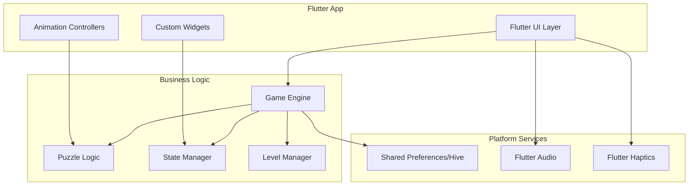

# Design Document

## Overview

The Water Sort Puzzle app will be built using Flutter, providing a unified development experience while delivering native performance on both iOS and Android. Flutter's widget-based architecture and powerful animation system make it ideal for creating smooth, responsive puzzle game interfaces with consistent behavior across platforms.

The architecture centers around a game engine that manages puzzle state, validates moves, and handles game progression, with Flutter widgets handling rendering, animations, and user interactions in a platform-agnostic manner while still compiling to native code.

## Architecture

### High-Level Architecture



### Technology Stack

**Flutter Framework:** Dart
- Single codebase for iOS and Android
- Custom widgets for game UI components
- Built-in animation system for smooth liquid effects
- Platform channels for native functionality when needed

**State Management:** Provider/Riverpod
- Reactive state management for game state
- Efficient widget rebuilding
- Clean separation of business logic and UI

**Storage:** Hive + Shared Preferences
- Hive for complex game state persistence
- Shared Preferences for simple settings
- Cross-platform compatibility

## Components and Interfaces

### Core Game Engine

**GameEngine**
```dart
abstract class GameEngine {
  GameState initializeLevel(int levelId);
  PourResult attemptPour(int fromContainer, int toContainer);
  bool undoLastMove();
  bool checkWinCondition();
  GameState getCurrentState();
  Future<void> saveState();
  Future<GameState?> loadState();
}
```

**Container Model**
```dart
class Container {
  final int id;
  final int capacity;
  final List<LiquidLayer> liquidLayers;
  
  Container({
    required this.id,
    required this.capacity,
    required this.liquidLayers,
  });
  
  bool canAcceptPour(LiquidColor liquidColor) { /* implementation */ }
  LiquidLayer? getTopLayer() { /* implementation */ }
  void addLiquid(LiquidLayer layer) { /* implementation */ }
  LiquidLayer? removeTopLayer() { /* implementation */ }
}

class LiquidLayer {
  final LiquidColor color;
  final int volume;
  
  LiquidLayer({required this.color, required this.volume});
}
```

**Game State Management**
```dart
class GameState {
  final int levelId;
  final List<Container> containers;
  final List<Move> moveHistory;
  final bool isCompleted;
  final int moveCount;
  
  GameState({
    required this.levelId,
    required this.containers,
    required this.moveHistory,
    required this.isCompleted,
    required this.moveCount,
  });
}

class Move {
  final int fromContainer;
  final int toContainer;
  final LiquidLayer liquidMoved;
  final DateTime timestamp;
  
  Move({
    required this.fromContainer,
    required this.toContainer,
    required this.liquidMoved,
    required this.timestamp,
  });
}
```

### Flutter UI Components

**Container Widget**
```dart
class ContainerWidget extends StatefulWidget {
  final Container container;
  final bool isSelected;
  final VoidCallback onTap;
  
  const ContainerWidget({
    Key? key,
    required this.container,
    required this.isSelected,
    required this.onTap,
  }) : super(key: key);
  
  @override
  _ContainerWidgetState createState() => _ContainerWidgetState();
}

class _ContainerWidgetState extends State<ContainerWidget>
    with TickerProviderStateMixin {
  late AnimationController _pourController;
  late AnimationController _selectionController;
  
  @override
  Widget build(BuildContext context) {
    // Flutter implementation with custom painting
    // for liquid layer rendering and pour animations
    return GestureDetector(
      onTap: widget.onTap,
      child: CustomPaint(
        painter: ContainerPainter(
          container: widget.container,
          isSelected: widget.isSelected,
          pourAnimation: _pourController,
        ),
        size: Size(80, 120),
      ),
    );
  }
}
```

### Level Management System

**Level Generator**
```dart
abstract class LevelGenerator {
  Level generateLevel(int difficulty, int colorCount, int containerCount);
  bool validateLevel(Level level);
}

class Level {
  final int id;
  final int difficulty;
  final List<Container> initialState;
  final int minimumMoves;
  final int? maxMoves;
  
  Level({
    required this.id,
    required this.difficulty,
    required this.initialState,
    required this.minimumMoves,
    this.maxMoves,
  });
}
```

## Data Models

### Core Data Structures

**Color System**
```dart
enum LiquidColor {
  red(0xFFFF0000, "Red"),
  blue(0xFF0000FF, "Blue"),
  green(0xFF00FF00, "Green"),
  yellow(0xFFFFFF00, "Yellow"),
  purple(0xFF800080, "Purple"),
  orange(0xFFFFA500, "Orange"),
  pink(0xFFFFC0CB, "Pink"),
  cyan(0xFF00FFFF, "Cyan");
  
  const LiquidColor(this.rgb, this.name);
  final int rgb;
  final String name;
  
  Color get color => Color(rgb);
}
```

**Persistence Models**
```dart
@JsonSerializable()
class GameProgress {
  final Set<int> unlockedLevels;
  final Set<int> completedLevels;
  final int? currentLevel;
  final GameState? savedGameState;
  
  GameProgress({
    required this.unlockedLevels,
    required this.completedLevels,
    this.currentLevel,
    this.savedGameState,
  });
  
  factory GameProgress.fromJson(Map<String, dynamic> json) => 
      _$GameProgressFromJson(json);
  Map<String, dynamic> toJson() => _$GameProgressToJson(this);
}

@JsonSerializable()
class PlayerStats {
  final int totalMoves;
  final int perfectSolutions;
  final int totalPlayTime;
  final double averageMovesPerLevel;
  
  PlayerStats({
    required this.totalMoves,
    required this.perfectSolutions,
    required this.totalPlayTime,
    required this.averageMovesPerLevel,
  });
  
  factory PlayerStats.fromJson(Map<String, dynamic> json) => 
      _$PlayerStatsFromJson(json);
  Map<String, dynamic> toJson() => _$PlayerStatsToJson(this);
}
```

### Animation Models

**Pour Animation Data**
```dart
class PourAnimation {
  final int fromContainer;
  final int toContainer;
  final LiquidColor liquidColor;
  final int volume;
  final Duration duration;
  
  PourAnimation({
    required this.fromContainer,
    required this.toContainer,
    required this.liquidColor,
    required this.volume,
    this.duration = const Duration(milliseconds: 800),
  });
}

abstract class AnimationState {
  const AnimationState();
}

class IdleState extends AnimationState {
  const IdleState();
}

class PouringState extends AnimationState {
  final PourAnimation animation;
  const PouringState(this.animation);
}

class VictoryState extends AnimationState {
  final Duration celebrationDuration;
  const VictoryState(this.celebrationDuration);
}
```

## Error Handling

### Game Logic Errors

**Invalid Move Handling**
```dart
abstract class PourResult {
  const PourResult();
}

class PourSuccess extends PourResult {
  const PourSuccess();
}

class PourInvalidMove extends PourResult {
  const PourInvalidMove();
}

class PourError extends PourResult {
  final PourErrorReason reason;
  const PourError(this.reason);
}

enum PourErrorReason {
  containerFull,
  colorMismatch,
  emptySource,
  sameContainer,
  invalidContainerId,
}
```

**Error Recovery Strategies**
- Invalid moves trigger visual feedback without changing game state
- Corrupted save data falls back to level 1 with progress reset notification
- Animation failures gracefully skip to final state
- Platform-specific errors (storage, audio) degrade functionality but maintain core gameplay

### Flutter Error Handling

**Game Exception Handling**
```dart
abstract class GameException implements Exception {
  final String message;
  final dynamic cause;
  
  const GameException(this.message, [this.cause]);
}

class SaveException extends GameException {
  const SaveException(String message, [dynamic cause]) : super(message, cause);
}

class LoadException extends GameException {
  const LoadException(String message, [dynamic cause]) : super(message, cause);
}

class AnimationException extends GameException {
  const AnimationException(String message, [dynamic cause]) : super(message, cause);
}

class ErrorHandler {
  static void handle(GameException error) {
    // Flutter-specific error logging and user notification
    // Using Flutter's logging and SnackBar for user feedback
  }
}
```

## Testing Strategy

### Unit Testing

**Flutter/Dart Testing**
- Game engine logic validation using `test` package
- Container state management unit tests
- Move validation algorithms testing
- Level generation and validation tests
- JSON serialization/deserialization tests

**Test Coverage Requirements**
- 90%+ coverage for core game logic
- 100% coverage for move validation
- Edge case testing for all container operations

### Widget Testing

**Flutter Widget Tests**
- Container widget rendering tests using `flutter_test`
- Animation controller behavior tests
- Touch gesture recognition tests
- Custom painter rendering validation
- State management integration tests

### Integration Testing

**Cross-Platform Consistency**
- Identical game behavior across platforms
- Save/load compatibility between platforms
- Performance benchmarking (60fps target)
- Memory usage optimization tests

### Performance Testing

**Animation Performance**
- Liquid pour animations maintain 60fps
- Container rendering scales with device capabilities
- Memory usage stays under 100MB during gameplay
- Battery usage optimization for extended play sessions

**Load Testing**
- Game state persistence under various conditions
- Level loading performance with increasing complexity
- Undo/redo operations with large move histories

## Flutter Implementation Details

### Animation System

**Flutter Animation Framework**
- Use `AnimationController` with `Tween` for smooth liquid transitions
- Implement custom `CustomPainter` for liquid layer rendering
- Leverage `AnimatedBuilder` for efficient widget rebuilding
- Use `HapticFeedback.lightImpact()` for tactile move confirmation

**Animation Performance**
- `SingleTickerProviderStateMixin` for simple animations
- `TickerProviderStateMixin` for multiple concurrent animations
- `AnimatedContainer` for simple property animations
- Custom interpolation curves for realistic liquid physics

### Storage Strategy

**Cross-Platform Storage**
- `shared_preferences` for simple game settings
- `hive` for complex game state with efficient serialization
- `path_provider` for platform-appropriate file locations
- JSON serialization with `json_annotation` for data persistence

### Platform Integration

**Native Features**
- `flutter/services` for haptic feedback
- `audioplayers` for cross-platform sound effects
- `flutter/material` and `flutter/cupertino` for platform-appropriate UI
- Platform channels for advanced native functionality if needed

### Performance Optimizations

**Rendering Optimizations**
- Lazy loading of level data
- Efficient container redraw only when state changes
- Bitmap caching for liquid layer textures
- GPU acceleration for animation effects

**Memory Management**
- Object pooling for frequently created/destroyed objects
- Efficient bitmap handling for liquid textures
- Proper cleanup of animation resources
- Background thread processing for level generation