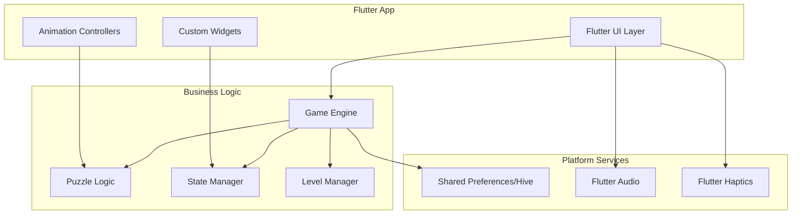

# Design Document

## Overview

The Water Sort Puzzle app will be built using Flutter, providing a unified development experience while delivering native performance on both iOS and Android. Flutter's widget-based architecture and powerful animation system make it ideal for creating smooth, responsive puzzle game interfaces with consistent behavior across platforms.

The architecture centers around a game engine that manages puzzle state, validates moves, and handles game progression, with Flutter widgets handling rendering, animations, and user interactions in a platform-agnostic manner while still compiling to native code.

## Architecture

### High-Level Architecture



### Technology Stack

**Flutter Framework:** Dart

- Single codebase for iOS and Android
- Custom widgets for game UI components
- Built-in animation system for smooth liquid effects
- Platform channels for native functionality when needed

**State Management:** Provider/Riverpod

- Reactive state management for game state
- Efficient widget rebuilding
- Clean separation of business logic and UI

**Storage:** Hive + Shared Preferences

- Hive for complex game state persistence
- Shared Preferences for simple settings
- Cross-platform compatibility

## Components and Interfaces

### Core Game Engine

**GameEngine**

```dart
abstract class GameEngine {
  GameState initializeLevel(int levelId);
  PourResult attemptPour(int fromContainer, int toContainer);
  bool undoLastMove();
  bool checkWinCondition();
  bool checkLossCondition();
  List<ValidMove> getValidMoves();
  GameState getCurrentState();
  Future<void> saveState();
  Future<GameState?> loadState();
}
```

**Container Model**

```dart
class Container {
  final int id;
  final int capacity;
  final List<LiquidLayer> liquidLayers;

  Container({
    required this.id,
    required this.capacity,
    required this.liquidLayers,
  });

  bool canAcceptPour(LiquidColor liquidColor) { /* implementation */ }
  LiquidLayer? getTopLayer() { /* implementation */ }
  void addLiquid(LiquidLayer layer) { /* implementation */ }
  LiquidLayer? removeTopLayer() { /* implementation */ }
}

class LiquidLayer {
  final LiquidColor color;
  final int volume;

  LiquidLayer({required this.color, required this.volume});
}
```

**Game State Management**

```dart
class GameState {
  final int levelId;
  final List<Container> containers;
  final List<Move> moveHistory;
  final bool isCompleted;
  final bool isLost;
  final int moveCount;

  GameState({
    required this.levelId,
    required this.containers,
    required this.moveHistory,
    required this.isCompleted,
    required this.isLost,
    required this.moveCount,
  });
}

class ValidMove {
  final int fromContainer;
  final int toContainer;
  final LiquidColor liquidColor;
  final int volume;

  ValidMove({
    required this.fromContainer,
    required this.toContainer,
    required this.liquidColor,
    required this.volume,
  });
}

class Move {
  final int fromContainer;
  final int toContainer;
  final LiquidLayer liquidMoved;
  final DateTime timestamp;

  Move({
    required this.fromContainer,
    required this.toContainer,
    required this.liquidMoved,
    required this.timestamp,
  });
}
```

### Flutter UI Components

**Container Widget**

```dart
class ContainerWidget extends StatefulWidget {
  final Container container;
  final bool isSelected;
  final VoidCallback onTap;

  const ContainerWidget({
    Key? key,
    required this.container,
    required this.isSelected,
    required this.onTap,
  }) : super(key: key);

  @override
  _ContainerWidgetState createState() => _ContainerWidgetState();
}

class _ContainerWidgetState extends State<ContainerWidget>
    with TickerProviderStateMixin {
  late AnimationController _pourController;
  late AnimationController _selectionController;

  @override
  Widget build(BuildContext context) {
    // Flutter implementation with custom painting
    // for liquid layer rendering and pour animations
    return GestureDetector(
      onTap: widget.onTap,
      child: CustomPaint(
        painter: ContainerPainter(
          container: widget.container,
          isSelected: widget.isSelected,
          pourAnimation: _pourController,
        ),
        size: Size(80, 120),
      ),
    );
  }
}
```

### Level Management System

**Level Generator with Similarity Detection**

```dart
abstract class LevelGenerator {
  Level generateLevel(int difficulty, int colorCount, int containerCount);
  Level generateUniqueLevel(int difficulty, int colorCount, int containerCount, List<Level> previousLevels);
  bool validateLevel(Level level);
  bool isLevelSimilar(Level newLevel, List<Level> previousLevels);
  String generateLevelSignature(Level level);
  bool hasCompletedContainers(Level level);
}

class LevelValidator {
  /// Validates that a generated level meets all requirements
  static bool validateGeneratedLevel(Level level) {
    return !_isAlreadySolved(level) &&
           !_hasCompletedContainers(level) &&
           _hasOptimalEmptySpace(level) &&
           _isSolvable(level);
  }

  /// Checks if the level is already in a solved state
  static bool _isAlreadySolved(Level level) {
    // A level is solved if all non-empty containers contain only one color
    for (final container in level.initialState) {
      if (container.liquidLayers.isEmpty) continue;

      final firstColor = container.liquidLayers.first.color;
      for (final layer in container.liquidLayers) {
        if (layer.color != firstColor) {
          return false; // Found mixed colors, not solved
        }
      }
    }
    return true; // All containers have single colors or are empty
  }

  /// Checks if any containers are already completed (single color and full)
  static bool _hasCompletedContainers(Level level) {
    for (final container in level.initialState) {
      if (_isContainerCompleted(container)) {
        return true;
      }
    }
    return false;
  }

  /// Determines if a container is completed (single color and full capacity)
  static bool _isContainerCompleted(Container container) {
    if (container.liquidLayers.isEmpty) return false;

    // Check if container is full
    final totalVolume = container.liquidLayers
        .fold<int>(0, (sum, layer) => sum + layer.volume);
    if (totalVolume != container.capacity) return false;

    // Check if all layers are the same color
    final firstColor = container.liquidLayers.first.color;
    return container.liquidLayers.every((layer) => layer.color == firstColor);
  }

  /// Validates optimal empty space (minimum needed to solve)
  static bool _hasOptimalEmptySpace(Level level) {
    // Implementation would calculate minimum empty containers/space needed
    // This is a complex algorithm that depends on the specific level layout
    return true; // Placeholder - actual implementation would be more complex
  }

  /// Removes unnecessary empty containers while maintaining solvability
  static Level optimizeEmptyContainers(Level level) {
    final containers = List<Container>.from(level.initialState);

    // Try removing each empty container and check if level remains solvable
    // Short-circuit: if one empty container is required, all remaining will be too
    for (int i = containers.length - 1; i >= 0; i--) {
      if (containers[i].liquidLayers.isEmpty) {
        // Create test level without this empty container
        final testContainers = List<Container>.from(containers);
        testContainers.removeAt(i);

        final testLevel = Level(
          id: level.id,
          difficulty: level.difficulty,
          initialState: testContainers,
          minimumMoves: level.minimumMoves,
          maxMoves: level.maxMoves,
          signature: level.signature,
        );

        // If still solvable without this empty container, remove it
        if (_isSolvable(testLevel)) {
          containers.removeAt(i);
        } else {
          // If this empty container is required, all remaining empty containers will be too
          // Short-circuit the loop for performance
          break;
        }
      }
    }

    return Level(
      id: level.id,
      difficulty: level.difficulty,
      initialState: containers,
      minimumMoves: level.minimumMoves,
      maxMoves: level.maxMoves,
      signature: LevelSimilarityChecker.generateNormalizedSignature(
        Level(
          id: level.id,
          difficulty: level.difficulty,
          initialState: containers,
          minimumMoves: level.minimumMoves,
          maxMoves: level.maxMoves,
          signature: '',
        ),
      ),
    );
  }

  /// Merges adjacent liquid layers of the same color into single layers
  static Level mergeAdjacentLayers(Level level) {
    final optimizedContainers = level.initialState.map((container) {
      if (container.liquidLayers.isEmpty) return container;

      final mergedLayers = <LiquidLayer>[];
      LiquidLayer? currentLayer;

      for (final layer in container.liquidLayers) {
        if (currentLayer == null) {
          currentLayer = layer;
        } else if (currentLayer.color == layer.color) {
          // Merge with previous layer of same color
          currentLayer = LiquidLayer(
            color: currentLayer.color,
            volume: currentLayer.volume + layer.volume,
          );
        } else {
          // Different color, add current layer and start new one
          mergedLayers.add(currentLayer);
          currentLayer = layer;
        }
      }

      // Add the final layer
      if (currentLayer != null) {
        mergedLayers.add(currentLayer);
      }

      return Container(
        id: container.id,
        capacity: container.capacity,
        liquidLayers: mergedLayers,
      );
    }).toList();

    return Level(
      id: level.id,
      difficulty: level.difficulty,
      initialState: optimizedContainers,
      minimumMoves: level.minimumMoves,
      maxMoves: level.maxMoves,
      signature: LevelSimilarityChecker.generateNormalizedSignature(
        Level(
          id: level.id,
          difficulty: level.difficulty,
          initialState: optimizedContainers,
          minimumMoves: level.minimumMoves,
          maxMoves: level.maxMoves,
          signature: '',
        ),
      ),
    );
  }

  /// Checks if the level is solvable using automated solving algorithms
  static bool _isSolvable(Level level) {
    // Implementation would use backtracking or other solving algorithms
    // to verify the level can be completed
    return true; // Placeholder - actual implementation would be more complex
  }
}

class Level {
  final int id;
  final int difficulty;
  final List<Container> initialState;
  final int minimumMoves;
  final int? maxMoves;
  final String signature;

  Level({
    required this.id,
    required this.difficulty,
    required this.initialState,
    required this.minimumMoves,
    this.maxMoves,
    required this.signature,
  });
}

class LevelSimilarityChecker {
  static const double similarityThreshold = 0.8;
  static const int maxGenerationAttempts = 50;

  static bool areLevelsSimilar(Level level1, Level level2) {
    // Compare structural patterns independent of specific colors and container order
    return _compareStructuralPatterns(level1, level2) > similarityThreshold;
  }

  static double _compareStructuralPatterns(Level level1, Level level2) {
    // Normalize both levels to color-agnostic patterns
    final pattern1 = _normalizeToPattern(level1);
    final pattern2 = _normalizeToPattern(level2);

    // Calculate similarity score based on:
    // 1. Container count and arrangement
    // 2. Layer distribution patterns
    // 3. Color mixing patterns (independent of actual colors)
    // 4. Container order independence (patterns can be reordered)
    return _calculatePatternSimilarity(pattern1, pattern2);
  }

  static String generateNormalizedSignature(Level level) {
    // Create color-agnostic signature representing the level structure
    // Format: "containers:4|pattern:ABAB,BABA,EMPTY,EMPTY"
    // Where A, B represent normalized color positions
    // Patterns are sorted to make container order irrelevant
    final containers = level.initialState;
    final normalizedContainers = _normalizeColors(containers);

    // Sort patterns to make container order irrelevant for comparison
    final sortedPatterns = List<String>.from(normalizedContainers)..sort();

    return "containers:${containers.length}|pattern:${sortedPatterns.join(',')}";
  }

  static List<String> _normalizeColors(List<Container> containers) {
    // Convert actual colors to normalized patterns (A, B, C, etc.)
    final colorMap = <LiquidColor, String>{};
    var nextColorLabel = 'A';

    return containers.map((container) {
      if (container.liquidLayers.isEmpty) return 'EMPTY';

      return container.liquidLayers.map((layer) {
        if (!colorMap.containsKey(layer.color)) {
          colorMap[layer.color] = nextColorLabel;
          nextColorLabel = String.fromCharCode(nextColorLabel.codeUnitAt(0) + 1);
        }
        return colorMap[layer.color]! * layer.volume;
      }).join('');
    }).toList();
  }

  static double _calculatePatternSimilarity(List<String> pattern1, List<String> pattern2) {
    if (pattern1.length != pattern2.length) return 0.0;

    // Sort both patterns to make container order irrelevant
    final sortedPattern1 = List<String>.from(pattern1)..sort();
    final sortedPattern2 = List<String>.from(pattern2)..sort();

    int matches = 0;
    for (int i = 0; i < sortedPattern1.length; i++) {
      if (sortedPattern1[i] == sortedPattern2[i]) matches++;
    }

    return matches / sortedPattern1.length;
  }

  static List<String> _normalizeToPattern(Level level) {
    return _normalizeColors(level.initialState);
  }
}

class LevelGenerationService {
  final LevelGenerator _generator;
  final List<Level> _sessionLevels = [];

  LevelGenerationService(this._generator);

  Future<Level> generateNextLevel(int difficulty, int colorCount, int containerCount) async {
    Level? uniqueLevel;
    int attempts = 0;

    while (uniqueLevel == null && attempts < LevelSimilarityChecker.maxGenerationAttempts) {
      final candidate = _generator.generateLevel(difficulty, colorCount, containerCount);

      if (!_generator.isLevelSimilar(candidate, _sessionLevels)) {
        uniqueLevel = candidate;
        _sessionLevels.add(uniqueLevel);
      }

      attempts++;
    }

    if (uniqueLevel == null) {
      // Fallback: clear session history and generate fresh
      _sessionLevels.clear();
      uniqueLevel = _generator.generateLevel(difficulty, colorCount, containerCount);
      _sessionLevels.add(uniqueLevel);
    }

    return uniqueLevel;
  }

  void clearSessionHistory() {
    _sessionLevels.clear();
  }
}
```

### Loss Detection System

**Move Validator and Loss Detector**

```dart
class MoveValidator {
  static List<ValidMove> getAllValidMoves(List<Container> containers) {
    final validMoves = <ValidMove>[];

    for (int fromIndex = 0; fromIndex < containers.length; fromIndex++) {
      final fromContainer = containers[fromIndex];
      final topLayer = fromContainer.getTopLayer();

      if (topLayer == null) continue; // Empty container, nothing to pour

      for (int toIndex = 0; toIndex < containers.length; toIndex++) {
        if (fromIndex == toIndex) continue; // Can't pour to same container

        final toContainer = containers[toIndex];

        if (_canPourTo(fromContainer, toContainer, topLayer)) {
          final volume = _calculatePourVolume(fromContainer, toContainer, topLayer);
          validMoves.add(ValidMove(
            fromContainer: fromIndex,
            toContainer: toIndex,
            liquidColor: topLayer.color,
            volume: volume,
          ));
        }
      }
    }

    return validMoves;
  }

  static bool _canPourTo(Container from, Container to, LiquidLayer topLayer) {
    // Check if target container has space
    if (to.isFull) return false;

    // Check if colors match or target is empty
    final toTopLayer = to.getTopLayer();
    return toTopLayer == null || toTopLayer.color == topLayer.color;
  }

  static int _calculatePourVolume(Container from, Container to, LiquidLayer topLayer) {
    // Calculate how much of the top continuous color can be poured
    int volume = 0;
    final targetColor = topLayer.color;

    // Count continuous layers of same color from top
    for (int i = from.liquidLayers.length - 1; i >= 0; i--) {
      if (from.liquidLayers[i].color == targetColor) {
        volume += from.liquidLayers[i].volume;
      } else {
        break;
      }
    }

    // Limit by target container capacity
    final availableSpace = to.capacity - to.currentVolume;
    return math.min(volume, availableSpace);
  }
}

class LossDetector {
  static bool hasLost(GameState gameState) {
    // If already won, not lost
    if (gameState.isCompleted) return false;

    // Check if any valid moves exist
    final validMoves = MoveValidator.getAllValidMoves(gameState.containers);
    return validMoves.isEmpty;
  }

  static String getLossMessage(GameState gameState) {
    return "No more valid moves available! The puzzle cannot be solved from this state.";
  }
}
```

**Loss State UI Components**

```dart
class LossDialog extends StatelessWidget {
  final String message;
  final VoidCallback onRestart;
  final VoidCallback onLevelSelect;

  const LossDialog({
    Key? key,
    required this.message,
    required this.onRestart,
    required this.onLevelSelect,
  }) : super(key: key);

  @override
  Widget build(BuildContext context) {
    return AlertDialog(
      title: const Text('Game Over'),
      content: Text(message),
      actions: [
        TextButton(
          onPressed: onLevelSelect,
          child: const Text('Level Select'),
        ),
        ElevatedButton(
          onPressed: onRestart,
          child: const Text('Restart Level'),
        ),
      ],
    );
  }
}

class GameOverOverlay extends StatefulWidget {
  final String message;
  final VoidCallback onRestart;
  final VoidCallback onLevelSelect;

  const GameOverOverlay({
    Key? key,
    required this.message,
    required this.onRestart,
    required this.onLevelSelect,
  }) : super(key: key);

  @override
  _GameOverOverlayState createState() => _GameOverOverlayState();
}

class _GameOverOverlayState extends State<GameOverOverlay>
    with SingleTickerProviderStateMixin {
  late AnimationController _controller;
  late Animation<double> _fadeAnimation;
  late Animation<double> _scaleAnimation;

  @override
  void initState() {
    super.initState();
    _controller = AnimationController(
      duration: const Duration(milliseconds: 500),
      vsync: this,
    );

    _fadeAnimation = Tween<double>(begin: 0.0, end: 1.0).animate(
      CurvedAnimation(parent: _controller, curve: Curves.easeIn),
    );

    _scaleAnimation = Tween<double>(begin: 0.8, end: 1.0).animate(
      CurvedAnimation(parent: _controller, curve: Curves.elasticOut),
    );

    _controller.forward();
  }

  @override
  void dispose() {
    _controller.dispose();
    super.dispose();
  }

  @override
  Widget build(BuildContext context) {
    return AnimatedBuilder(
      animation: _controller,
      builder: (context, child) {
        return Opacity(
          opacity: _fadeAnimation.value,
          child: Container(
            color: Colors.black54,
            child: Center(
              child: Transform.scale(
                scale: _scaleAnimation.value,
                child: Card(
                  margin: const EdgeInsets.all(32),
                  child: Padding(
                    padding: const EdgeInsets.all(24),
                    child: Column(
                      mainAxisSize: MainAxisSize.min,
                      children: [
                        const Icon(
                          Icons.sentiment_dissatisfied,
                          size: 64,
                          color: Colors.orange,
                        ),
                        const SizedBox(height: 16),
                        const Text(
                          'Game Over',
                          style: TextStyle(
                            fontSize: 24,
                            fontWeight: FontWeight.bold,
                          ),
                        ),
                        const SizedBox(height: 8),
                        Text(
                          widget.message,
                          textAlign: TextAlign.center,
                          style: const TextStyle(fontSize: 16),
                        ),
                        const SizedBox(height: 24),
                        Row(
                          mainAxisSize: MainAxisSize.min,
                          children: [
                            TextButton(
                              onPressed: widget.onLevelSelect,
                              child: const Text('Level Select'),
                            ),
                            const SizedBox(width: 16),
                            ElevatedButton(
                              onPressed: widget.onRestart,
                              child: const Text('Restart Level'),
                            ),
                          ],
                        ),
                      ],
                    ),
                  ),
                ),
              ),
            ),
          ),
        );
      },
    );
  }
}
```

## Data Models

### Core Data Structures

**Color System**

```dart
enum LiquidColor {
  red(0xFFFF0000, "Red"),
  blue(0xFF0000FF, "Blue"),
  green(0xFF00FF00, "Green"),
  yellow(0xFFFFFF00, "Yellow"),
  purple(0xFF800080, "Purple"),
  orange(0xFFFFA500, "Orange"),
  pink(0xFFFFC0CB, "Pink"),
  cyan(0xFF00FFFF, "Cyan");

  const LiquidColor(this.rgb, this.name);
  final int rgb;
  final String name;

  Color get color => Color(rgb);
}
```

**Persistence Models**

```dart
@JsonSerializable()
class GameProgress {
  final Set<int> unlockedLevels;
  final Set<int> completedLevels;
  final int? currentLevel;
  final GameState? savedGameState;

  GameProgress({
    required this.unlockedLevels,
    required this.completedLevels,
    this.currentLevel,
    this.savedGameState,
  });

  factory GameProgress.fromJson(Map<String, dynamic> json) =>
      _$GameProgressFromJson(json);
  Map<String, dynamic> toJson() => _$GameProgressToJson(this);
}

@JsonSerializable()
class PlayerStats {
  final int totalMoves;
  final int perfectSolutions;
  final int totalPlayTime;
  final double averageMovesPerLevel;

  PlayerStats({
    required this.totalMoves,
    required this.perfectSolutions,
    required this.totalPlayTime,
    required this.averageMovesPerLevel,
  });

  factory PlayerStats.fromJson(Map<String, dynamic> json) =>
      _$PlayerStatsFromJson(json);
  Map<String, dynamic> toJson() => _$PlayerStatsToJson(this);
}
```

### Animation Models

**Pour Animation Data**

```dart
class PourAnimation {
  final int fromContainer;
  final int toContainer;
  final LiquidColor liquidColor;
  final int volume;
  final Duration duration;
  final bool canBeInterrupted;

  PourAnimation({
    required this.fromContainer,
    required this.toContainer,
    required this.liquidColor,
    required this.volume,
    this.duration = const Duration(milliseconds: 800),
    this.canBeInterrupted = true,
  });
}

abstract class AnimationState {
  const AnimationState();
}

class IdleState extends AnimationState {
  const IdleState();
}

class PouringState extends AnimationState {
  final PourAnimation animation;
  const PouringState(this.animation);
}

class VictoryState extends AnimationState {
  final Duration celebrationDuration;
  const VictoryState(this.celebrationDuration);
}

class LossState extends AnimationState {
  final String message;
  const LossState(this.message);
}

class AnimationQueue {
  final List<PourAnimation> _pendingAnimations = [];
  PourAnimation? _currentAnimation;

  void addAnimation(PourAnimation animation) {
    _pendingAnimations.add(animation);
  }

  void skipCurrentAnimation() {
    _currentAnimation = null;
  }

  PourAnimation? getNextAnimation() {
    if (_pendingAnimations.isNotEmpty) {
      _currentAnimation = _pendingAnimations.removeAt(0);
      return _currentAnimation;
    }
    return null;
  }

  void clearQueue() {
    _pendingAnimations.clear();
    _currentAnimation = null;
  }

  bool get hasAnimations => _pendingAnimations.isNotEmpty || _currentAnimation != null;
}
```

## Error Handling

### Game Logic Errors

**Invalid Move Handling**

```dart
abstract class PourResult {
  const PourResult();
}

class PourSuccess extends PourResult {
  const PourSuccess();
}

class PourInvalidMove extends PourResult {
  const PourInvalidMove();
}

class PourError extends PourResult {
  final PourErrorReason reason;
  const PourError(this.reason);
}

enum PourErrorReason {
  containerFull,
  colorMismatch,
  emptySource,
  sameContainer,
  invalidContainerId,
}
```

**Error Recovery Strategies**

- Invalid moves trigger visual feedback without changing game state
- Corrupted save data falls back to level 1 with progress reset notification
- Animation failures gracefully skip to final state
- Platform-specific errors (storage, audio) degrade functionality but maintain core gameplay

### Flutter Error Handling

**Game Exception Handling**

```dart
abstract class GameException implements Exception {
  final String message;
  final dynamic cause;

  const GameException(this.message, [this.cause]);
}

class SaveException extends GameException {
  const SaveException(String message, [dynamic cause]) : super(message, cause);
}

class LoadException extends GameException {
  const LoadException(String message, [dynamic cause]) : super(message, cause);
}

class AnimationException extends GameException {
  const AnimationException(String message, [dynamic cause]) : super(message, cause);
}

class ErrorHandler {
  static void handle(GameException error) {
    // Flutter-specific error logging and user notification
    // Using Flutter's logging and SnackBar for user feedback
  }
}
```

## Testing Strategy

### Unit Testing

**Flutter/Dart Testing**

- Game engine logic validation using `test` package
- Container state management unit tests
- Move validation algorithms testing
- Level generation and validation tests
- Level similarity detection algorithm tests
- Pattern normalization and signature generation tests
- JSON serialization/deserialization tests

**Test Coverage Requirements**

- 90%+ coverage for core game logic
- 100% coverage for move validation
- 100% coverage for level similarity detection
- Edge case testing for all container operations
- Comprehensive testing of pattern matching edge cases

### Widget Testing

**Flutter Widget Tests**

- Container widget rendering tests using `flutter_test`
- Animation controller behavior tests
- Touch gesture recognition tests
- Custom painter rendering validation
- State management integration tests

### Integration Testing

**Cross-Platform Consistency**

- Identical game behavior across platforms
- Save/load compatibility between platforms
- Performance benchmarking (60fps target)
- Memory usage optimization tests

### Performance Testing

**Animation Performance**

- Liquid pour animations maintain 60fps
- Container rendering scales with device capabilities
- Memory usage stays under 100MB during gameplay
- Battery usage optimization for extended play sessions

**Load Testing**

- Game state persistence under various conditions
- Level loading performance with increasing complexity
- Undo/redo operations with large move histories

## Flutter Implementation Details

### Animation System

**Flutter Animation Framework**

- Use `AnimationController` with `Tween` for smooth liquid transitions
- Implement custom `CustomPainter` for liquid layer rendering
- Leverage `AnimatedBuilder` for efficient widget rebuilding
- Use `HapticFeedback.lightImpact()` for tactile move confirmation

**Non-Blocking UI Architecture**

- Separate game state updates from animation rendering
- Implement animation queue system for managing multiple concurrent animations
- Allow animation interruption when new moves are initiated
- Use `StreamController` for decoupling game logic from UI animations
- Maintain responsive touch handling during animation playback

**Animation Performance**

- `SingleTickerProviderStateMixin` for simple animations
- `TickerProviderStateMixin` for multiple concurrent animations
- `AnimatedContainer` for simple property animations
- Custom interpolation curves for realistic liquid physics
- Animation skipping/completion for rapid move sequences

### Storage Strategy

**Cross-Platform Storage**

- `shared_preferences` for simple game settings
- `hive` for complex game state with efficient serialization
- `path_provider` for platform-appropriate file locations
- JSON serialization with `json_annotation` for data persistence

### Platform Integration

**Native Features**

- `flutter/services` for haptic feedback
- `audioplayers` for cross-platform sound effects
- `flutter/material` and `flutter/cupertino` for platform-appropriate UI
- Platform channels for advanced native functionality if needed

### Performance Optimizations

**Rendering Optimizations**

- Lazy loading of level data
- Efficient container redraw only when state changes
- Bitmap caching for liquid layer textures
- GPU acceleration for animation effects

**Memory Management**

- Object pooling for frequently created/destroyed objects
- Efficient bitmap handling for liquid textures
- Proper cleanup of animation resources
- Background thread processing for level generation

## Difficulty Analysis and Level Design

**Core Difficulty Mechanics**

The difficulty of a water sort puzzle is determined by several interconnected factors that affect the cognitive load and strategic planning required from players. Understanding these mechanics is crucial for generating levels that provide appropriate challenge progression.

**1. Trap Moves and Dead-End States**

The most sophisticated difficulty mechanic involves creating situations where the most obvious or intuitive move leads to an unsolvable state. This forces players to think beyond immediate gratification and consider long-term consequences.

```dart
class TrapMoveAnalyzer {
  /// Identifies moves that appear beneficial but lead to dead ends
  static List<TrapMove> identifyTrapMoves(Level level) {
    final allMoves = MoveValidator.getAllValidMoves(level.initialState);
    final trapMoves = <TrapMove>[];

    for (final move in allMoves) {
      final resultState = _simulateMove(level.initialState, move);

      // Check if this move appears beneficial (consolidates colors, empties containers)
      if (_appearsIntuitivelyGood(move, level.initialState)) {
        // But actually makes the puzzle unsolvable
        if (!_isSolvableFromState(resultState)) {
          trapMoves.add(TrapMove(
            move: move,
            trapType: _classifyTrapType(move, level.initialState, resultState),
            intuitionScore: _calculateIntuitionScore(move, level.initialState),
          ));
        }
      }
    }

    return trapMoves;
  }

  static bool _appearsIntuitivelyGood(ValidMove move, List<Container> state) {
    // Moves that appear good:
    // - Consolidate same colors
    // - Empty a container completely
    // - Move to an empty container
    // - Create a single-color container
    return _consolidatesSameColor(move, state) ||
           _emptiesSourceContainer(move, state) ||
           _movesToEmptyContainer(move, state) ||
           _createsSingleColorContainer(move, state);
  }

  static TrapType _classifyTrapType(ValidMove move, List<Container> before, List<Container> after) {
    if (_createsColorLock(before, after)) return TrapType.colorLock;
    if (_wastesEmptySpace(before, after)) return TrapType.spaceWaste;
    if (_createsInaccessibleColor(before, after)) return TrapType.colorBurial;
    if (_breaksRequiredSequence(before, after)) return TrapType.sequenceBreak;
    return TrapType.general;
  }
}

enum TrapType {
  colorLock,    // Creates a situation where colors can't be separated
  spaceWaste,   // Wastes limited empty container space
  colorBurial,  // Buries a color that will be needed later
  sequenceBreak, // Breaks a required move sequence
  general       // Other trap scenarios
}

class TrapMove {
  final ValidMove move;
  final TrapType trapType;
  final double intuitionScore; // How intuitive/obvious the move appears (0-1)

  TrapMove({
    required this.move,
    required this.trapType,
    required this.intuitionScore,
  });
}
```

**2. Planning Depth Requirements**

Difficulty increases with the number of moves players must plan ahead to avoid dead ends or find the optimal solution path.

```dart
class PlanningDepthAnalyzer {
  /// Calculates the minimum planning depth required to solve the level
  static int calculateRequiredPlanningDepth(Level level) {
    return _findShortestSolutionPath(level.initialState).length;
  }

  /// Identifies critical decision points where wrong choices lead to dead ends
  static List<CriticalDecision> findCriticalDecisions(Level level) {
    final solutionPath = _findShortestSolutionPath(level.initialState);
    final criticalDecisions = <CriticalDecision>[];

    for (int i = 0; i < solutionPath.length; i++) {
      final currentState = _getStateAtStep(level.initialState, solutionPath, i);
      final validMoves = MoveValidator.getAllValidMoves(currentState);

      // Count how many of the valid moves lead to dead ends
      int deadEndMoves = 0;
      for (final move in validMoves) {
        final resultState = _simulateMove(currentState, move);
        if (!_isSolvableFromState(resultState)) {
          deadEndMoves++;
        }
      }

      // If most moves lead to dead ends, this is a critical decision point
      if (deadEndMoves > validMoves.length * 0.6) {
        criticalDecisions.add(CriticalDecision(
          stepIndex: i,
          totalOptions: validMoves.length,
          deadEndOptions: deadEndMoves,
          correctMove: solutionPath[i],
        ));
      }
    }

    return criticalDecisions;
  }
}

class CriticalDecision {
  final int stepIndex;
  final int totalOptions;
  final int deadEndOptions;
  final ValidMove correctMove;

  CriticalDecision({
    required this.stepIndex,
    required this.totalOptions,
    required this.deadEndOptions,
    required this.correctMove,
  });

  double get difficultyRatio => deadEndOptions / totalOptions;
}
```

**3. Color Distribution Complexity**

The arrangement and mixing of colors significantly affects difficulty through pattern recognition and planning requirements.

```dart
class ColorComplexityAnalyzer {
  /// Analyzes how colors are distributed and mixed in containers
  static ColorComplexity analyzeColorDistribution(Level level) {
    final containers = level.initialState;

    return ColorComplexity(
      colorFragmentation: _calculateColorFragmentation(containers),
      layerDepthVariance: _calculateLayerDepthVariance(containers),
      colorInterleaving: _calculateColorInterleaving(containers),
      dominantColorBalance: _calculateDominantColorBalance(containers),
    );
  }

  /// Measures how scattered each color is across containers
  static double _calculateColorFragmentation(List<Container> containers) {
    final colorDistribution = <LiquidColor, List<int>>{};

    // Track which containers each color appears in
    for (int i = 0; i < containers.length; i++) {
      final container = containers[i];
      final colorsInContainer = container.liquidLayers.map((l) => l.color).toSet();

      for (final color in colorsInContainer) {
        colorDistribution.putIfAbsent(color, () => []).add(i);
      }
    }

    // Calculate average fragmentation (colors spread across multiple containers)
    double totalFragmentation = 0;
    for (final containerList in colorDistribution.values) {
      totalFragmentation += containerList.length - 1; // -1 because 1 container = no fragmentation
    }

    return totalFragmentation / colorDistribution.length;
  }

  /// Measures how deeply colors are buried under other colors
  static double _calculateLayerDepthVariance(List<Container> containers) {
    final colorDepths = <LiquidColor, List<int>>{};

    for (final container in containers) {
      for (int depth = 0; depth < container.liquidLayers.length; depth++) {
        final color = container.liquidLayers[depth].color;
        colorDepths.putIfAbsent(color, () => []).add(depth);
      }
    }

    // Calculate variance in depths for each color
    double totalVariance = 0;
    for (final depths in colorDepths.values) {
      if (depths.length > 1) {
        final mean = depths.reduce((a, b) => a + b) / depths.length;
        final variance = depths.map((d) => pow(d - mean, 2)).reduce((a, b) => a + b) / depths.length;
        totalVariance += variance;
      }
    }

    return totalVariance / colorDepths.length;
  }

  /// Measures how colors are interleaved (alternating patterns)
  static double _calculateColorInterleaving(List<Container> containers) {
    double totalInterleaving = 0;
    int containerCount = 0;

    for (final container in containers) {
      if (container.liquidLayers.length > 1) {
        int colorChanges = 0;
        for (int i = 1; i < container.liquidLayers.length; i++) {
          if (container.liquidLayers[i].color != container.liquidLayers[i-1].color) {
            colorChanges++;
          }
        }
        totalInterleaving += colorChanges / (container.liquidLayers.length - 1);
        containerCount++;
      }
    }

    return containerCount > 0 ? totalInterleaving / containerCount : 0;
  }

  /// Measures how evenly colors are distributed by volume
  static double _calculateDominantColorBalance(List<Container> containers) {
    final colorVolumes = <LiquidColor, int>{};

    for (final container in containers) {
      for (final layer in container.liquidLayers) {
        colorVolumes[layer.color] = (colorVolumes[layer.color] ?? 0) + layer.volume;
      }
    }

    if (colorVolumes.isEmpty) return 0;

    final volumes = colorVolumes.values.toList();
    final maxVolume = volumes.reduce(math.max);
    final minVolume = volumes.reduce(math.min);

    // Return balance ratio (1.0 = perfectly balanced, 0.0 = completely unbalanced)
    return maxVolume > 0 ? minVolume / maxVolume : 0;
  }
}

class ColorComplexity {
  final double colorFragmentation;    // How scattered colors are (0-1+)
  final double layerDepthVariance;    // How varied color depths are (0-1+)
  final double colorInterleaving;     // How alternated colors are (0-1)
  final double dominantColorBalance;  // How balanced color volumes are (0-1)

  ColorComplexity({
    required this.colorFragmentation,
    required this.layerDepthVariance,
    required this.colorInterleaving,
    required this.dominantColorBalance,
  });

  double get overallComplexity {
    return (colorFragmentation * 0.3 +
            layerDepthVariance * 0.3 +
            colorInterleaving * 0.2 +
            (1 - dominantColorBalance) * 0.2);
  }
}
```

**4. Container Utilization and Space Management**

Difficulty increases when players must carefully manage limited empty space and container capacity.

```dart
class SpaceManagementAnalyzer {
  /// Analyzes how efficiently space must be used to solve the level
  static SpaceEfficiency analyzeSpaceRequirements(Level level) {
    final containers = level.initialState;
    final emptyContainers = containers.where((c) => c.liquidLayers.isEmpty).length;
    final totalCapacity = containers.fold<int>(0, (sum, c) => sum + c.capacity);
    final usedCapacity = containers.fold<int>(0, (sum, c) => sum + c.currentVolume);

    return SpaceEfficiency(
      emptyContainerRatio: emptyContainers / containers.length,
      capacityUtilization: usedCapacity / totalCapacity,
      criticalSpacePoints: _findCriticalSpacePoints(level),
      temporarySpaceNeeded: _calculateTemporarySpaceNeeds(level),
    );
  }

  /// Identifies points in the solution where space management is critical
  static List<SpaceConstraint> _findCriticalSpacePoints(Level level) {
    final solutionPath = _findShortestSolutionPath(level.initialState);
    final constraints = <SpaceConstraint>[];

    for (int i = 0; i < solutionPath.length; i++) {
      final state = _getStateAtStep(level.initialState, solutionPath, i);
      final emptySpace = _calculateAvailableSpace(state);
      final requiredSpace = _calculateRequiredSpaceForRemainingSolution(state, solutionPath.sublist(i));

      if (requiredSpace > emptySpace * 0.8) { // Using 80% of available space
        constraints.add(SpaceConstraint(
          stepIndex: i,
          availableSpace: emptySpace,
          requiredSpace: requiredSpace,
          constraintSeverity: requiredSpace / emptySpace,
        ));
      }
    }

    return constraints;
  }

  /// Calculates how much temporary space is needed during solution
  static int _calculateTemporarySpaceNeeds(Level level) {
    final solutionPath = _findShortestSolutionPath(level.initialState);
    int maxTemporarySpace = 0;

    for (int i = 0; i < solutionPath.length; i++) {
      final state = _getStateAtStep(level.initialState, solutionPath, i);
      final temporarySpace = _calculateTemporarySpaceAtStep(state, solutionPath.sublist(i));
      maxTemporarySpace = math.max(maxTemporarySpace, temporarySpace);
    }

    return maxTemporarySpace;
  }
}

class SpaceEfficiency {
  final double emptyContainerRatio;     // Ratio of empty to total containers
  final double capacityUtilization;     // How full containers are overall
  final List<SpaceConstraint> criticalSpacePoints; // Points where space is critical
  final int temporarySpaceNeeded;       // Max temporary space needed during solution

  SpaceEfficiency({
    required this.emptyContainerRatio,
    required this.capacityUtilization,
    required this.criticalSpacePoints,
    required this.temporarySpaceNeeded,
  });

  double get spaceComplexity {
    final criticalPointsScore = criticalSpacePoints.length / 10.0; // Normalize
    final utilizationScore = capacityUtilization;
    final temporarySpaceScore = temporarySpaceNeeded / 20.0; // Normalize

    return (criticalPointsScore * 0.4 + utilizationScore * 0.3 + temporarySpaceScore * 0.3)
        .clamp(0.0, 1.0);
  }
}

class SpaceConstraint {
  final int stepIndex;
  final int availableSpace;
  final int requiredSpace;
  final double constraintSeverity;

  SpaceConstraint({
    required this.stepIndex,
    required this.availableSpace,
    required this.requiredSpace,
    required this.constraintSeverity,
  });
}
```

**5. Comprehensive Difficulty Scoring**

```dart
class DifficultyAnalyzer {
  /// Calculates overall difficulty score for a level
  static DifficultyScore analyzeLevelDifficulty(Level level) {
    final trapMoves = TrapMoveAnalyzer.identifyTrapMoves(level);
    final criticalDecisions = PlanningDepthAnalyzer.findCriticalDecisions(level);
    final colorComplexity = ColorComplexityAnalyzer.analyzeColorDistribution(level);
    final spaceEfficiency = SpaceManagementAnalyzer.analyzeSpaceRequirements(level);
    final planningDepth = PlanningDepthAnalyzer.calculateRequiredPlanningDepth(level);

    return DifficultyScore(
      trapMoveScore: _calculateTrapMoveScore(trapMoves),
      planningDepthScore: _calculatePlanningDepthScore(planningDepth, criticalDecisions),
      colorComplexityScore: colorComplexity.overallComplexity,
      spaceManagementScore: spaceEfficiency.spaceComplexity,
      overallDifficulty: _calculateOverallDifficulty(trapMoves, criticalDecisions, colorComplexity, spaceEfficiency, planningDepth),
      difficultyFactors: _identifyPrimaryDifficultyFactors(trapMoves, criticalDecisions, colorComplexity, spaceEfficiency),
    );
  }

  static double _calculateTrapMoveScore(List<TrapMove> trapMoves) {
    if (trapMoves.isEmpty) return 0.0;

    // Weight by how intuitive the trap moves are
    final weightedScore = trapMoves.fold<double>(0.0, (sum, trap) => sum + trap.intuitionScore);
    return (weightedScore / trapMoves.length).clamp(0.0, 1.0);
  }

  static double _calculatePlanningDepthScore(int planningDepth, List<CriticalDecision> criticalDecisions) {
    final depthScore = (planningDepth / 20.0).clamp(0.0, 1.0); // Normalize to 20 moves max
    final criticalScore = criticalDecisions.isEmpty ? 0.0 :
        criticalDecisions.map((d) => d.difficultyRatio).reduce((a, b) => a + b) / criticalDecisions.length;

    return (depthScore * 0.6 + criticalScore * 0.4);
  }

  static double _calculateOverallDifficulty(
    List<TrapMove> trapMoves,
    List<CriticalDecision> criticalDecisions,
    ColorComplexity colorComplexity,
    SpaceEfficiency spaceEfficiency,
    int planningDepth,
  ) {
    final trapScore = _calculateTrapMoveScore(trapMoves);
    final planningScore = _calculatePlanningDepthScore(planningDepth, criticalDecisions);
    final colorScore = colorComplexity.overallComplexity;
    final spaceScore = spaceEfficiency.spaceComplexity;

    // Weighted combination of all factors
    return (trapScore * 0.35 +           // Trap moves are most important for difficulty
            planningScore * 0.25 +       // Planning depth is second most important
            colorScore * 0.25 +          // Color complexity affects pattern recognition
            spaceScore * 0.15)           // Space management adds constraint pressure
        .clamp(0.0, 1.0);
  }

  static List<DifficultyFactor> _identifyPrimaryDifficultyFactors(
    List<TrapMove> trapMoves,
    List<CriticalDecision> criticalDecisions,
    ColorComplexity colorComplexity,
    SpaceEfficiency spaceEfficiency,
  ) {
    final factors = <DifficultyFactor>[];

    if (trapMoves.isNotEmpty) {
      factors.add(DifficultyFactor.trapMoves);
    }
    if (criticalDecisions.length > 2) {
      factors.add(DifficultyFactor.criticalDecisions);
    }
    if (colorComplexity.colorInterleaving > 0.6) {
      factors.add(DifficultyFactor.colorInterleaving);
    }
    if (colorComplexity.colorFragmentation > 1.5) {
      factors.add(DifficultyFactor.colorFragmentation);
    }
    if (spaceEfficiency.criticalSpacePoints.length > 1) {
      factors.add(DifficultyFactor.spaceConstraints);
    }

    return factors;
  }
}

class DifficultyScore {
  final double trapMoveScore;         // 0-1, how many/obvious trap moves exist
  final double planningDepthScore;    // 0-1, how much planning ahead is required
  final double colorComplexityScore;  // 0-1, how complex color patterns are
  final double spaceManagementScore;  // 0-1, how critical space management is
  final double overallDifficulty;     // 0-1, weighted combination of all factors
  final List<DifficultyFactor> difficultyFactors; // Primary sources of difficulty

  DifficultyScore({
    required this.trapMoveScore,
    required this.planningDepthScore,
    required this.colorComplexityScore,
    required this.spaceManagementScore,
    required this.overallDifficulty,
    required this.difficultyFactors,
  });

  DifficultyLevel get difficultyLevel {
    if (overallDifficulty < 0.2) return DifficultyLevel.trivial;
    if (overallDifficulty < 0.4) return DifficultyLevel.easy;
    if (overallDifficulty < 0.6) return DifficultyLevel.medium;
    if (overallDifficulty < 0.8) return DifficultyLevel.hard;
    return DifficultyLevel.expert;
  }
}

enum DifficultyFactor {
  trapMoves,
  criticalDecisions,
  colorInterleaving,
  colorFragmentation,
  spaceConstraints,
}

enum DifficultyLevel {
  trivial,
  easy,
  medium,
  hard,
  expert,
}
```

**Integration with Level Generation**

```dart
abstract class DifficultyAwareLevelGenerator extends LevelGenerator {
  /// Generates a level targeting a specific difficulty score
  Level generateLevelWithTargetDifficulty(
    int colorCount,
    int containerCount,
    double targetDifficulty,
    List<DifficultyFactor> desiredFactors,
  );

  /// Validates that generated level meets difficulty requirements
  bool validateDifficultyRequirements(Level level, double targetDifficulty, double tolerance);
}
```

This comprehensive difficulty analysis system provides:

1. **Trap Move Detection** - Identifies moves that appear good but lead to dead ends
2. **Planning Depth Analysis** - Measures how far ahead players must think
3. **Color Complexity Scoring** - Quantifies pattern recognition challenges
4. **Space Management Analysis** - Evaluates container utilization constraints
5. **Comprehensive Scoring** - Combines all factors into actionable difficulty metrics

The system can be used during level generation to ensure levels meet specific difficulty targets and provide the right type of challenge for different skill levels.
